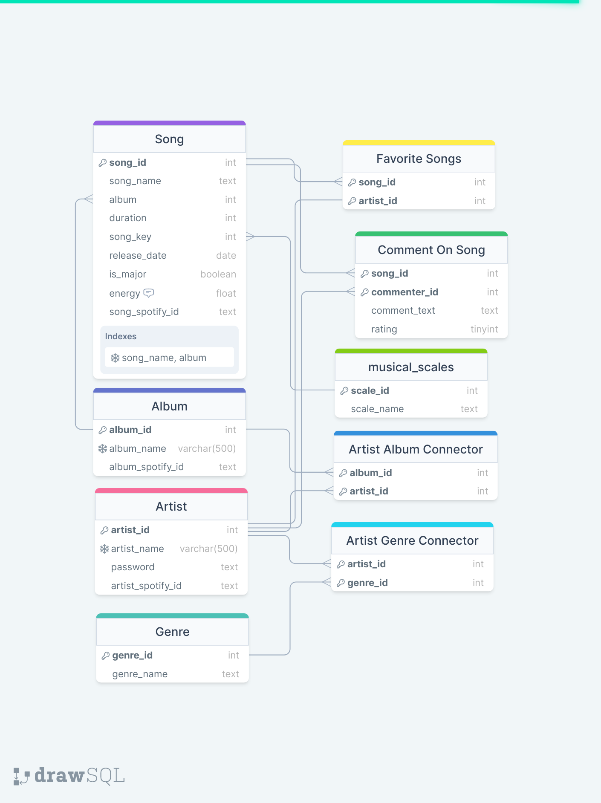

# Database workshop project - Music Social Network
Created and submitted by: 
1. Yuval Uner, ***REMOVED***
2. Ori Roza, ***REMOVED***,
3. Amiram Yasif, ***REMOVED*** 

## Data
### Data sets
We used 2 datasets for our database:
1. [Spotify 1.2M+ Songs](http://millionsongdataset.com/).
2. [Song lyrics from 79 musical genres](https://www.kaggle.com/datasets/neisse/scrapped-lyrics-from-6-genres?select=artists-data.csv)

The first dataset contains 1.2M+ songs with their features, such as:
* Artist name
* Song name
* Album name
* Release year
* Duration

And more, containing 24 fields in total, with the first 3 stated above being the main ones we used.\
It is from this dataset that we extracted the songs, most of the artists, and albums that we used
in our database - a total of about 1.2 milion songs, 140000 artists and 160000 albums.\
It is also via this dataset that we were able to link the information together, in the database,
as there are various many-to-many relationships between the entities, which will be discussed in the database
section of this document.\
\
The second dataset contains 2 files, artist-data.csv and lyrics-data.csv, from which we only used
artist-data.csv.\
From this dataset, we extracted the genres of the artists, and were thus able to create a list of genres that
our application uses, as well as link the artists found in this dataset to their genres.

### Data processing and insertion
To process our data, we used a script that can be found in /server/src/db_data_inserts_preprocessing.py.\
Running this script as is, with the correct parameters set in the .env file, will fill the database with all of the data.\
This script is responsible for processing the data from the datasets, and inserting it into the database.\
The script is divided into 3 main parts:
1. Processing the data from artist-data.csv, from the 79 musical genres dataset.
2. Processing the data from track-features.csv, from the 1.2 million songs dataset.
3. Generating data

#### Processing the data from artist-data.csv
To process this data, the script has a class called ArtistDataMethods.\
This class contains 6 methods, that always work in pairs:
1. collect_genres_set - collects all the genres from the dataset, and returns a set of them.
2. add_genres - gets the set from the previous method and adds it to the database.
3. collect_artists_set - collects all the artists from the dataset, and returns a set of them.
4. add_artists - gets the set from the previous method and adds it to the database.
5. get_artist_genre_connections - gets the links between artists and genres from the dataset, and returns a list of them.
6. link_artist_to_genres - gets the list from the previous method and links the artists to their genres in the database.

By calling these methods in the correct order, the script is able to process the data from artist-data.csv, and insert it into the database.

#### Processing the data from track-features.csv
To process this data, the script has a class called TrackFeaturesMethods.\
This class contains 10 methods, most of which work in pairs:
1. collect_artist_and_spotify_ids - collects all the artists and their spotify ids from the dataset, and stores them in a dictionary.
2. add_artists - uses the dictionary from the previous method and adds the artists to the database.
3. collect_albums_and_spotify_ids - collects all the albums and their spotify ids from the dataset, and stores them in a dictionary.
4. add_albums - uses the dictionary from the previous method and adds the albums to the database.
5. collect_artist_and_album_connections - collects all the links between artists and albums from the dataset, and stores them in a dictionary.
6. link_artists_to_albums - uses the dictionary from the previous method and links the artists to their albums in the database.
7. add_keys - adds the musical keys (C, C#, D, D#, E, F, F#, G, G#, A, A#, B) to the database.
8. map_index_to_key - maps the index of the key in the dataset to the key's name.
9. collect_track_features - collects all the track features from the dataset, and stores them in a dictionary.
10. add_songs - uses the dictionary from the previous method and adds the songs to the database.

By calling these methods in the correct order, the script is able to process the data from track-features.csv, and insert it into the database.

#### Generating data
As we did not have comments on songs or any data on a user's favorite songs - we elected to generate them instead, 
so that we could have a more complete database where most users have some data on them.\
In addition, as most artists did not have a genre (due to artist-data.csv only containing 4000 artists), we also
created random links between artists and genres, leading to some artists having very questionable genres.\
This is done using the methods found in the class GeneratedDataAdder, which contains 3 methods:
1. generate_and_add_comments - generates random comments on songs, and adds them to the database. The comments are taken from a static list.
2. generate_and_add_favorite_songs - generates random favorite songs for users, and adds them to the database.
3. add_random_links - generates random links between artists and genres, and adds them to the database.

For all of the above, the script uses hardcoded parameters which fit our database (but may not fit a clean insert, as 
due to insert errors we had to delete from tables with auto incremented ids, leading to the ids not starting from 1).\
These are created in the classes' __init__ method, and are used in the methods themselves.

## Database
### Database schema

### Database entities and tables
#### Artist (table: artists)
The artists entity is equivalent to a user in our application, and is one of the main entities in the database.\
It contains the fields:
1. artist_id - an auto incremented id, used as a primary key.
2. artist_name - the name of the artist. Also a unique key / index.
3. password - the password of the artist.
4. artist_spotify_id - the spotify id of the artist.

All of the above fields (except for password, which is either auto generated or set by the user) are taken from the datasets.\
Due to the above unique key restriction, some artists from the dataset were not added.\
However, as we still have a large number of artists (143000 or so), this is not a problem.

#### Album (table: albums)
The album entity is one of the main entities in our database.\
It contains the fields:
1. album_id - an auto incremented id, used as a primary key.
2. album_name - the name of the album. Also a unique key / index.
3. album_spotify_id - the spotify id of the album.

All of the above fields were taken from the 1.2 million songs dataset.
Due to the above unique key restriction, some albums from the dataset were not added.
This however, is not a problem, as we still have a large number of albums (105100 or so).
In addition, as some albums had the same name, but different artists, those artists were linked to the same album, 
resulting in some albums having multiple artists linked to it, even though they are not the same album.

#### artist_album_connector table
This table is used to link artists to albums, and is a many-to-many relationship.\
It contains the fields:
1. artist_id - the id of the artist. Also a foreign key to the artists table.
2. album_id - the id of the album. Also a foreign key to the albums table.

Both of the above fields are used as a composite primary key.\
All of the connections were taken from the 1.2 million songs dataset.

#### Genre (table: genres)
The genre entity is used to broadly represent which genre each song and album belongs to.\
In our database, genres are only linked to artists, and the genre of a song, artist and album is determined by the genres of the artists.\
It contains the fields:
1. genre_id - an auto incremented id, used as a composite primary key.\
2. genre_name - the name of the genre.

All 79 genres in our database were taken from the 79 genres in the artist-data.csv dataset.

#### artist_genre_connector table
This table is used to link artists to genres, and is a many-to-many relationship.\
Each artist can have multiple genres linked to it, and each genre can have multiple artists linked to it.\
It contains the fields:
1. artist_id - the id of the artist. Also a foreign key to the artists table.
2. genre_id - the id of the genre. Also a foreign key to the genres table.

both of the above fields are used as a primary key.
The connections in this table were taken from the artist-data.csv dataset, and then some were randomly generated.

#### Musical key (table: musical_scales)
The musical key entity is used to represent the musical key of a song.\
It is a static list of 12 keys, and is used to determine the musical key of a song.\
It contains the fields:
1. scale_id - an auto incremented id, used as a primary key.
2. scale_name - the name of the musical key.

#### Song (table: songs)
The song entity is one of the main entities in our database.\
It contains the fields:
1. song_id - an auto incremented id, used as a primary key.
2. song_name - the name of the song.
3. song_spotify_id - the spotify id of the song.
4. album - the album the song is from. Also a foreign key to the albums table.
5. song_key - the key (scale) of the song. Also a foreign key to the musical_scales table.
6. release_date - the release date of the song.
7. is_major - a boolean value representing whether the song is in a major key or not.
8. energy - the energy of the song. A value between 0 and 1.
9. duration - the duration of the song, in milliseconds.

All of the above values were taken from the 1.2 million songs dataset.
The table has a unique key on the combination of song_name, album - as we do not allow 2 songs in the same album
to have the same name.\
Due to this restriction, a small amount of songs were not added to the database.\
The database still has 1186700 or so songs, which is more than enough for our application.

#### favorite_songs table
This table is used to link songs to artists, and is a many-to-many relationship.\
By adding a tuple to this table, an artist can mark a song as one of their favorite songs.\
It contains the fields:
1. artist_id - the id of the artist. Also a foreign key to the artists table.
2. song_id - the id of the song. Also a foreign key to the songs table.

Both fields together are used as a composite primary key.\
The data in this table was randomly generated.

#### song_comments table
This table stores comments on songs.\
It contains the fields:
1. commenter_id - the id of the artist who commented on the song. Also a foreign key to the artists table.
2. song_id - the id of the song. Also a foreign key to the songs table.
3. comment_text - the text of the comment itself.
4. rating - the rating the user left on the song. A value between 1 and 5.

The commenter_id and song_id fields together are used as a composite primary key.\
The data in this table was randomly generated.

### Other data saved in the database
The database also contains some stored procedures and functions.\
Some of them were used to perform all of the initial inserts into the database, as can be seen by the 
code in the python script used to process the data always using "CALL <procedure_name>".\
This was possible because the insertions were done by a single member of the team, who then gave a dump file to the rest.\
After that, however, we kept the queries directly in our python code, as we had no real way to share them
(as the database is local on our own personal machines).\
Other stored procedures that can be found in the database are copies of the queries in our python code, as 
as the member who created the dump file that we uploaded also backed up their queries into stored procedures
for easy future access.

## Queries
All queries used in the application can be found in the server, under repositories package.\
More details about the structure and the code can be found in the next section.\
Also note that in all of the usage examples states, the code used is not from our application but the simplest code possible
that can be used to demonstrate the query.\
In addition, we only list the queries that are actually used by the application - both server and client, 
despite the repositories having some other queries
that were used for testing purposes only 
and ones that were written by some team members when they did not stick to our planned queries.
### Artist related queries
All of these queries can be found in artists_repository, found in repositories/artists.py.

#### Add artist:
This query is used to add an artist to the database.\
It is used when a user registers to the application.\
It is a simple insert query, inserting the artist's name and password into the database.\
The query:
```sql
INSERT INTO artists VALUES (NULL, %s, %s, NULL)
```
\
The first parameter is the artist's name, and the second is the artist's password.
Example usage:
```python
def add_artist(self, artist_name, password):
    self.cursor.execute("INSERT INTO artists VALUES (NULL, %s, %s, NULL)", (artist_name, password))
    self.connection.commit()

add_artist("John Doe", "123456")
# Translates to: INSERT INTO artists VALUES (NULL, "John Doe", "123456", NULL)
```

#### Get artist by name:
This query is used to get an artist from the database by their name.\
It is often used to get data about an artist.\
It is a simple select query, selecting all of the artist's data from the database.\
The query:
```sql
SELECT * FROM artists WHERE artist_name = %s
```
\
The parameter is the artist's name.\
Example usage:
```python
def get_artist_by_name(self, artist_name):
    self.cursor.execute("SELECT * FROM artists WHERE artist_name = %s", (artist_name,))
    return self.cursor.fetchone()

get_artist_by_name("Taylor Swift")
# Translates to: SELECT * FROM artists WHERE artist_name = "Taylor Swift"
```

#### Login artist check:
This query is used to check if an artist name and password combination exist in the database.\
It is used when authorizing an artist to log in to the application.\
It is a simple select query, selecting the artist's name and password from the database.\
The query:
```sql
SELECT * FROM artists WHERE artist_name = %s AND pwd = %s
```
The first parameter is the artist's name, and the second is the artist's password.\
Example usage:
```python
def login_artist_check(self, artist_name, password):
    self.cursor.execute("SELECT * FROM artists WHERE artist_name = %s AND pwd = %s", (artist_name, password))
    return len(self.cursor.fetchone()) > 0

login_artist_check("John Doe", "123456")
# Translates to: SELECT * FROM artists WHERE artist_name = "John Doe" AND pwd = "123456"
```

#### Get artist albums:
This query is used to get all of the albums of an artist.\
It is used when displaying the albums of an artist.\
It is a more complex query, utilizing multiple sub-queries to get only the set of albums related to the artist.\
The query:
```sql
SELECT * FROM albums WHERE album_id IN(
SELECT album_id FROM artist_album_connector WHERE artist_id = 
(SELECT artist_id FROM artists WHERE artist_name = %s))
```

The parameter is the artist's name.\
Example usage:
```python
def get_artist_albums(self, artist_name):
    self.cursor.execute("SELECT * FROM albums WHERE album_id IN("
                        "SELECT album_id FROM artist_album_connector WHERE artist_id = "
                        "(SELECT artist_id FROM artists WHERE artist_name = %s))", (artist_name,))
    return self.cursor.fetchall()

get_artist_albums("Taylor Swift")
# Translates to:
# SELECT * FROM albums WHERE album_id IN(
# SELECT album_id FROM artist_album_connector WHERE artist_id =
# (SELECT artist_id FROM artists WHERE artist_name = "Taylor Swift"))
```

#### Get artist average rating:
This query is used to get the average rating of an artist.\
It is a more complex query, utilizing multiple sub-queries and aggregation.\
The query:
```sql
SELECT AVG(rating) FROM comment_on_song WHERE song_id IN
        (SELECT song_id FROM songs WHERE album IN
            (SELECT album_id FROM albums WHERE album_id IN(
                SELECT album_id FROM artist_album_connector WHERE artist_id = 
                    (SELECT artist_id FROM artists WHERE artist_name = %s))))
```

The parameter is the artist's name.\
Example usage:
```python
def get_artist_average_rating(self, artist_name):
    self.cursor.execute("SELECT AVG(rating) FROM comment_on_song WHERE song_id IN"
                        "(SELECT song_id FROM songs WHERE album IN"
                        "(SELECT album_id FROM albums WHERE album_id IN("
                        "SELECT album_id FROM artist_album_connector WHERE artist_id = "
                        "(SELECT artist_id FROM artists WHERE artist_name = %s))))", (artist_name,))
    return self.cursor.fetchone()[0]

get_artist_average_rating("Taylor Swift")
# Translates to:
# SELECT AVG(rating) FROM comment_on_song WHERE song_id IN
# (SELECT song_id FROM songs WHERE album IN
# (SELECT album_id FROM albums WHERE album_id IN(
# SELECT album_id FROM artist_album_connector WHERE artist_id =
# (SELECT artist_id FROM artists WHERE artist_name = "Taylor Swift"))))
```

#### Get highest rated artists
This query is used to get the highest rated artists.\
It is a more complex query, utilizing multiple sub-queries and joins over multiple tables.\
The query:
```sql
SELECT artist_name, avg_art FROM artists JOIN
    (SELECT artist_id, AVG(avg_alb) AS avg_art FROM artist_album_connector AS abc JOIN(
        SELECT album, AVG(avg_rate) as avg_alb FROM songs JOIN
            (SELECT AVG(rating) as avg_rate, song_id
            FROM comment_on_song GROUP BY song_id) AS avg_ratings
        ON avg_ratings.song_id = songs.song_id GROUP BY album) AS avg_album_ratings
    ON avg_album_ratings.album = abc.album_id GROUP BY artist_id) AS avg_artist_rating
ON artists.artist_id = avg_artist_rating.artist_id ORDER BY avg_art DESC LIMIT %s;
```

The parameter is the number of artists to get.\
Example usage:
```python
def get_highest_rated_artists(self, num_artists):
    self.cursor.execute("SELECT artist_name, avg_art FROM artists JOIN"
                        "(SELECT artist_id, AVG(avg_alb) AS avg_art FROM artist_album_connector AS abc JOIN("
                        "SELECT album, AVG(avg_rate) as avg_alb FROM songs JOIN"
                        "(SELECT AVG(rating) as avg_rate, song_id"
                        "FROM comment_on_song GROUP BY song_id) AS avg_ratings"
                        "ON avg_ratings.song_id = songs.song_id GROUP BY album) AS avg_album_ratings"
                        "ON avg_album_ratings.album = abc.album_id GROUP BY artist_id) AS avg_artist_rating"
                        "ON artists.artist_id = avg_artist_rating.artist_id ORDER BY avg_art DESC LIMIT %s", (num_artists,))
    return self.cursor.fetchall()

get_highest_rated_artists(10)
# Translates to:
# SELECT artist_name, avg_art FROM artists JOIN
# (SELECT artist_id, AVG(avg_alb) AS avg_art FROM artist_album_connector AS abc JOIN(
# SELECT album, AVG(avg_rate) as avg_alb FROM songs JOIN
# (SELECT AVG(rating) as avg_rate, song_id
# FROM comment_on_song GROUP BY song_id) AS avg_ratings
# ON avg_ratings.song_id = songs.song_id GROUP BY album) AS avg_album_ratings
# ON avg_album_ratings.album = abc.album_id GROUP BY artist_id) AS avg_artist_rating
# ON artists.artist_id = avg_artist_rating.artist_id ORDER BY avg_art DESC LIMIT 10;
```

#### Link artist to genre:
This query is used to link an artist to a genre, and is generally used when the user adds a new song.\
The query:
```sql
INSERT INTO artist_genre_connector VALUES
    ((SELECT artist_id FROM artists WHERE artist_name = %s),
    (SELECT genre_id FROM genres WHERE genre_name = %s))
```

The parameters are the artist's name and the genre's name.\
Example usage:
```python
def link_artist_to_genre(self, artist_name, genre_name):
    self.cursor.execute("INSERT INTO artist_genre_connector VALUES"
                        "((SELECT artist_id FROM artists WHERE artist_name = %s),"
                        "(SELECT genre_id FROM genres WHERE genre_name = %s))", (artist_name, genre_name))
    self.connection.commit()

link_artist_to_genre("Taylor Swift", "Pop")
# Translates to:
# INSERT INTO artist_genre_connector VALUES
# ((SELECT artist_id FROM artists WHERE artist_name = "Taylor Swift"),
# (SELECT genre_id FROM genres WHERE genre_name = "Pop"))
```

### Album related queries

#### Get Album Artists
This query is used to get the list of artists related to an album.\
The query:
```sql
SELECT artist_name FROM artists WHERE artist_id IN(
    SELECT artist_id FROM artist_album_connector WHERE album_id = 
    (SELECT album_id FROM albums WHERE album_name = %s));
```

The parameter is the album's name.\
Example usage:
```python
def get_album_artists(self, album_name):
    self.cursor.execute("SELECT artist_name FROM artists WHERE artist_id IN("
                        "SELECT artist_id FROM artist_album_connector WHERE album_id = "
                        "(SELECT album_id FROM albums WHERE album_name = %s));", (album_name,))
    return self.cursor.fetchall()

get_album_artists("Fearless")
# Translates to:
# SELECT artist_name FROM artists WHERE artist_id IN(
# SELECT artist_id FROM artist_album_connector WHERE album_id =
# (SELECT album_id FROM albums WHERE album_name = "Fearless"));
```

#### Get album by name:
This query is used to get an album and its rating by its name.\
The query:
```sql
SELECT album_id, album_name, album_spotify_id, AVG(averages.rtg)
FROM albums JOIN (SELECT song_id, AVG(rating) AS rtg  FROM comment_on_song
    WHERE song_id IN (SELECT song_id FROM songs WHERE album = 
        (SELECT album_id FROM albums WHERE album_name= %s ))
        GROUP BY song_id) AS averages
    WHERE album_name = %s
GROUP by album_id;
```

The parameter is the album's name.\
Example usage:
```python
def get_album_by_name(self, album_name):
    self.cursor.execute("SELECT album_id, album_name, album_spotify_id, AVG(averages.rtg)"
                        "FROM albums JOIN (SELECT song_id, AVG(rating) AS rtg  FROM comment_on_song"
                        "WHERE song_id IN (SELECT song_id FROM songs WHERE album = "
                        "(SELECT album_id FROM albums WHERE album_name= %s ))"
                        "GROUP BY song_id) AS averages"
                        "WHERE album_name = %s"
                        "GROUP by album_id;", (album_name, album_name))
    return self.cursor.fetchall()

get_album_by_name("Fearless")
# Translates to:
# SELECT album_id, album_name, album_spotify_id, AVG(averages.rtg)
# FROM albums JOIN (SELECT song_id, AVG(rating) AS rtg  FROM comment_on_song
# WHERE song_id IN (SELECT song_id FROM songs WHERE album =
# (SELECT album_id FROM albums WHERE album_name= "Fearless" ))
# GROUP BY song_id) AS averages
# WHERE album_name = "Fearless"
# GROUP by album_id;
```

#### Add album:
This query is used to add a new album to the database.\
The query:
```sql
INSERT INTO albums VALUES (NULL, %s, %s);
```

The parameters are the album's name and the album's spotify id.\
Example usage:
```python
def add_album(self, album_name, album_spotify_id):
    self.cursor.execute("INSERT INTO albums VALUES (NULL, %s, %s);", (album_name, album_spotify_id))
    self.connection.commit()

add_album("Fearless", "2pJ8zZ0JiZaIyf4UkYRdaS")
# Translates to:
# INSERT INTO albums VALUES (NULL, "Fearless, "2pJ8zZ0JiZaIyf4UkYRdaS");
```

#### Add artist connection:
This query is used to link an artist to an album, making it so the artist is one of the album's creators.\
The query:
```sql
INSERT INTO artist_album_connector VALUES (
                (SELECT artist_id FROM artists WHERE artist_name=%s),
                (SELECT album_id FROM albums WHERE album_name=%s)
            );
```

The parameters are the artist's name and the album's name.\
Example usage:
```python
def add_artist_connection(self, artist_name, album_name):
    self.cursor.execute("INSERT INTO artist_album_connector VALUES ("
                        "(SELECT artist_id FROM artists WHERE artist_name=%s),"
                        "(SELECT album_id FROM albums WHERE album_name=%s)"
                        ");", (artist_name, album_name))
    self.connection.commit()

add_artist_connection("Taylor Swift", "Fearless")
# Translates to:
# INSERT INTO artist_album_connector VALUES (
# (SELECT artist_id FROM artists WHERE artist_name="Taylor Swift"),
# (SELECT album_id FROM albums WHERE album_name="Fearless")
# );
```

### Song related queries

#### Approximate song search with artist and album:
This query is used to search for a song by its name, and get the song's artist and album.\
It uses a like clause to search for the song's name.\
The query:
```sql
SELECT s.song_name, s.duration, s.song_key, s.release_date, s.is_major,
s.energy, s.song_spotify_id, art_alb_full.ar_name AS artist_name,
art_alb_full.al_id AS album_id, art_alb_full.album_name 
FROM songs as s JOIN
    (SELECT alb.album_id AS al_id, alb.album_name, alb.album_spotify_id, a_id, ar_name 
    FROM albums AS alb JOIN 
        (SELECT art.artist_id AS a_id, abc.album_id AS al_id, art.artist_name AS ar_name 
        FROM artist_album_connector AS abc JOIN 
        artists as art ON art.artist_id = abc.artist_id) 
    AS art_alb ON art_alb.al_id = alb.album_id) 
AS art_alb_full 
ON s.album =  art_alb_full.al_id WHERE s.song_name LIKE CONCAT('%', %s, '%');
```

The parameter is the song's name.\
Example usage:
```python
def approximate_song_search_with_artist_and_album(self, song_name):
    self.cursor.execute("SELECT s.song_name, s.duration, s.song_key, s.release_date, s.is_major,"
                        "s.energy, s.song_spotify_id, art_alb_full.ar_name AS artist_name,"
                        "art_alb_full.al_id AS album_id, art_alb_full.album_name "
                        "FROM songs as s JOIN"
                        "(SELECT alb.album_id AS al_id, alb.album_name, alb.album_spotify_id, a_id, ar_name "
                        "FROM albums AS alb JOIN "
                        "(SELECT art.artist_id AS a_id, abc.album_id AS al_id, art.artist_name AS ar_name "
                        "FROM artist_album_connector AS abc JOIN "
                        "artists as art ON art.artist_id = abc.artist_id) "
                        "AS art_alb ON art_alb.al_id = alb.album_id) "
                        "AS art_alb_full "
                        "ON s.album =  art_alb_full.al_id WHERE s.song_name LIKE CONCAT('%', %s, '%');", (song_name,))
    return self.cursor.fetchall()

approximate_song_search_with_artist_and_album("Love Story")
# Translates to:
# SELECT s.song_name, s.duration, s.song_key, s.release_date, s.is_major,
# s.energy, s.song_spotify_id, art_alb_full.ar_name AS artist_name,
# art_alb_full.al_id AS album_id, art_alb_full.album_name
# FROM songs as s JOIN
# (SELECT alb.album_id AS al_id, alb.album_name, alb.album_spotify_id, a_id, ar_name
# FROM albums AS alb JOIN
# (SELECT art.artist_id AS a_id, abc.album_id AS al_id, art.artist_name AS ar_name
# FROM artist_album_connector AS abc JOIN
# artists as art ON art.artist_id = abc.artist_id)
# AS art_alb ON art_alb.al_id = alb.album_id)
# AS art_alb_full
# ON s.album = art_alb_full.al_id WHERE s.song_name LIKE CONCAT('%', "Love Story", '%');
```

#### Exact song search with artist and album:
This query is used to search for a song by its name, and get the song's artist and album.\
It uses an equal clause to search for the song's name.\
Other than that, it is the same as the approximate song search with artist and album.\
The query:
```sql
SELECT s.song_name, s.duration, s.song_key, s.release_date, s.is_major,
s.energy, s.song_spotify_id, art_alb_full.ar_name AS artist_name,
art_alb_full.al_id AS album_id, art_alb_full.album_name
FROM songs as s JOIN
    (SELECT alb.album_id AS al_id, alb.album_name, alb.album_spotify_id, a_id, ar_name
    FROM albums AS alb JOIN
        (SELECT art.artist_id AS a_id, abc.album_id AS al_id, art.artist_name AS ar_name
        FROM artist_album_connector AS abc JOIN
        artists as art ON art.artist_id = abc.artist_id)
    AS art_alb ON art_alb.al_id = alb.album_id)
AS art_alb_full
ON s.album =  art_alb_full.al_id WHERE s.song_name = %s;
```

The parameter is the song's name.\

Example usage:
```python
def exact_song_search_with_artist_and_album(self, song_name):
    self.cursor.execute("SELECT s.song_name, s.duration, s.song_key, s.release_date, s.is_major,"
                        "s.energy, s.song_spotify_id, art_alb_full.ar_name AS artist_name,"
                        "art_alb_full.al_id AS album_id, art_alb_full.album_name "
                        "FROM songs as s JOIN"
                        "(SELECT alb.album_id AS al_id, alb.album_name, alb.album_spotify_id, a_id, ar_name "
                        "FROM albums AS alb JOIN "
                        "(SELECT art.artist_id AS a_id, abc.album_id AS al_id, art.artist_name AS ar_name "
                        "FROM artist_album_connector AS abc JOIN "
                        "artists as art ON art.artist_id = abc.artist_id) "
                        "AS art_alb ON art_alb.al_id = alb.album_id) "
                        "AS art_alb_full "
                        "ON s.album =  art_alb_full.al_id WHERE s.song_name = %s;", (song_name,))
    return self.cursor.fetchall()

exact_song_search_with_artist_and_album("Love Story")
# Translates to:
# SELECT s.song_name, s.duration, s.song_key, s.release_date, s.is_major,
# s.energy, s.song_spotify_id, art_alb_full.ar_name AS artist_name,
# art_alb_full.al_id AS album_id, art_alb_full.album_name
# FROM songs as s JOIN
# (SELECT alb.album_id AS al_id, alb.album_name, alb.album_spotify_id, a_id, ar_name
# FROM albums AS alb JOIN
# (SELECT art.artist_id AS a_id, abc.album_id AS al_id, art.artist_name AS ar_name
# FROM artist_album_connector AS abc JOIN
# artists as art ON art.artist_id = abc.artist_id)
# AS art_alb ON art_alb.al_id = alb.album_id)
# AS art_alb_full
# ON s.album = art_alb_full.al_id WHERE s.song_name = "Love Story";
```

#### Get song by song name and album name:
This query is used to search for a song by its name and album name.\
It is the main way to get information about a song (and only a song) due to the unique key on these fields.\
The query:
```sql
SELECT * FROM songs AS s WHERE
s.album = (SELECT album_id FROM albums WHERE album_name = %s)
AND s.song_name = %s;
```

The parameters are the song's name and the album's name.\
Example usage:
```python
def get_song_by_song_name_and_album_name(self, song_name, album_name):
    self.cursor.execute("SELECT * FROM songs AS s WHERE "
                        "s.album = (SELECT album_id FROM albums WHERE album_name = %s) "
                        "AND s.song_name = %s;", (album_name, song_name))
    return self.cursor.fetchall()

get_song_by_song_name_and_album_name("Love Story", "Fearless")
# Translates to:
# SELECT * FROM songs AS s WHERE
# s.album = (SELECT album_id FROM albums WHERE album_name = "Fearless")
# AND s.song_name = "Love Story";
```

#### Get songs in album:
This query is used to get all the songs in an album.\
The query:
```sql
SELECT * FROM songs AS s WHERE
s.album = (SELECT album_id FROM albums WHERE album_name = %s);
```

The parameter is the album's name.\
Example usage:
```python
def get_songs_in_album(self, album_name):
    self.cursor.execute("SELECT * FROM songs AS s WHERE "
                        "s.album = (SELECT album_id FROM albums WHERE album_name = %s);", (album_name,))
    return self.cursor.fetchall()

get_songs_in_album("Fearless")
# Translates to:
# SELECT * FROM songs AS s WHERE
# s.album = (SELECT album_id FROM albums WHERE album_name = "Fearless");
```

#### Get song rating:
This query is used to get the average rating of a song, by all the ratings on it.\
The query:
```sql
SELECT AVG(rating) FROM comment_on_song 
WHERE song_id = (SELECT song_id FROM songs WHERE song_name = %s 
    AND album = (SELECT album_id FROM albums WHERE album_name = %s));
```

The parameters are the song's name and the album's name.\

Example usage:
```python
def get_song_rating(self, song_name, album_name):
    self.cursor.execute("SELECT AVG(rating) FROM comment_on_song "
                        "WHERE song_id = (SELECT song_id FROM songs WHERE song_name = %s "
                        "AND album = (SELECT album_id FROM albums WHERE album_name = %s));",
                        (song_name, album_name))
    return self.cursor.fetchall()

get_song_rating("Love Story", "Fearless")
# Translates to:
# SELECT AVG(rating) FROM comment_on_song
# WHERE song_id = (SELECT song_id FROM songs WHERE song_name = "Love Story"
# AND album = (SELECT album_id FROM albums WHERE album_name = "Fearless"));
```

#### Get top rated songs:
This query is used to get the top rated songs of all time.\
The query:
```sql
SELECT artist_name, album_name, song_name, duration, song_key, release_date, is_major, energy,
song_spotify_id, avg_rating FROM artists JOIN 
    (SELECT artist_id, abc.album_id, album_name, song_id, song_name, duration, song_key, release_date, is_major,
    energy, song_spotify_id, avg_rating FROM artist_album_connector AS abc JOIN
        (SELECT * FROM albums JOIN(
            SELECT songs.song_id, song_name, album, duration, song_key, release_Date, is_major, energy, song_spotify_id,
             avg_rating
            FROM songs JOIN
                (SELECT AVG(rating) as avg_rating, song_id FROM comment_on_song GROUP BY song_id ORDER BY avg_rating
                 DESC LIMIT %s)
            AS rtngs 
ON songs.song_id = rtngs.song_id
GROUP BY songs.song_id) AS best_songs ON albums.album_id = best_songs.album)
AS bs_albums ON abc.album_id = bs_albums.album_id) AS bsa_artists ON bsa_artists.artist_id = artists.artist_id;
```

The parameter is the number of songs to return.\

Example usage:
```python
def get_top_rated_songs(self, num_of_songs):
    self.cursor.execute("SELECT artist_name, album_name, song_name, duration, song_key, release_date, is_major, energy, "
                        "song_spotify_id, avg_rating FROM artists JOIN "
                        "(SELECT artist_id, abc.album_id, album_name, song_id, song_name, duration, song_key, release_date, "
                        "is_major, energy, song_spotify_id, avg_rating FROM artist_album_connector AS abc JOIN "
                        "(SELECT * FROM albums JOIN("
                        "SELECT songs.song_id, song_name, album, duration, song_key, release_Date, is_major, energy, "
                        "song_spotify_id, avg_rating "
                        "FROM songs JOIN "
                        "(SELECT AVG(rating) as avg_rating, song_id FROM comment_on_song GROUP BY song_id ORDER BY "
                        "avg_rating DESC LIMIT %s) "
                        "AS rtngs "
                        "ON songs.song_id = rtngs.song_id "
                        "GROUP BY songs.song_id) AS best_songs ON albums.album_id = best_songs.album) "
                        "AS bs_albums ON abc.album_id = bs_albums.album_id) AS bsa_artists ON bsa_artists.artist_id = "
                        "artists.artist_id;", (num_of_songs,))
    return self.cursor.fetchall()

get_top_rated_songs(10)
# Translates to:
# SELECT artist_name, album_name, song_name, duration, song_key, release_date, is_major, energy,
# song_spotify_id, avg_rating FROM artists JOIN
#     (SELECT artist_id, abc.album_id, album_name, song_id, song_name, duration, song_key, release_date, is_major,
#     energy, song_spotify_id, avg_rating FROM artist_album_connector AS abc JOIN
#         (SELECT * FROM albums JOIN(
#             SELECT songs.song_id, song_name, album, duration, song_key, release_Date, is_major, energy, song_spotify_id,
#              avg_rating
#             FROM songs JOIN
#                 (SELECT AVG(rating) as avg_rating, song_id FROM comment_on_song GROUP BY song_id ORDER BY avg_rating
#                  DESC LIMIT 10)
#             AS rtngs
# ON songs.song_id = rtngs.song_id
# GROUP BY songs.song_id) AS best_songs ON albums.album_id = best_songs.album)
# AS bs_albums ON abc.album_id = bs_albums.album_id) AS bsa_artists ON bsa_artists.artist_id = artists.artist_id;
```

#### Get top rated songs by year:
This query is used to get the top rated songs of a specific year.\
The query:
```sql
SELECT artist_name, album_name, song_name, duration, song_key, release_date, is_major, energy,
         song_spotify_id, avg_rating FROM artists JOIN(
        SELECT artist_id, abc.album_id, album_name, song_id, song_name, duration, song_key, release_date,
         is_major, energy, song_spotify_id, avg_rating  FROM artist_album_connector AS abc JOIN
        (SELECT * FROM albums JOIN(
        SELECT year_songs.song_id, song_name, album, duration, song_key, release_Date, is_major, energy,
         song_spotify_id, avg_rating
        FROM (SELECT * FROM songs WHERE YEAR(release_date) = YEAR(STR_TO_DATE(%s, "%Y-%m-%d"))) AS year_songs
        JOIN (SELECT AVG(rating) as avg_rating, song_id FROM comment_on_song GROUP BY song_id)
        AS rtngs 
        ON year_songs.song_id = rtngs.song_id
        GROUP BY year_songs.song_id
        ORDER BY avg_rating DESC
        LIMIT %s) AS top ON albums.album_id = top.album) AS top_with_albums ON top_with_albums.album_id = abc.album_id)
        AS top_with_artist_ids ON top_with_artist_ids.artist_id = artists.artist_id;
```

The first parameter is the year to get the top rated songs from.\
The second parameter is the number of songs to return.\
Example usage:
```python
def get_top_rated_songs_by_year(self, year, num_of_songs):
    self.cursor.execute("SELECT artist_name, album_name, song_name, duration, song_key, release_date, is_major, energy, "
                        "song_spotify_id, avg_rating FROM artists JOIN("
                        "SELECT artist_id, abc.album_id, album_name, song_id, song_name, duration, song_key, release_date, "
                        "is_major, energy, song_spotify_id, avg_rating  FROM artist_album_connector AS abc JOIN"
                        "(SELECT * FROM albums JOIN("
                        "SELECT year_songs.song_id, song_name, album, duration, song_key, release_Date, is_major, energy, "
                        "song_spotify_id, avg_rating "
                        "FROM (SELECT * FROM songs WHERE YEAR(release_date) = YEAR(STR_TO_DATE(%s, \"%Y-%m-%d\"))) AS "
                        "year_songs "
                        "JOIN (SELECT AVG(rating) as avg_rating, song_id FROM comment_on_song GROUP BY song_id) "
                        "AS rtngs "
                        "ON year_songs.song_id = rtngs.song_id "
                        "GROUP BY year_songs.song_id "
                        "ORDER BY avg_rating DESC "
                        "LIMIT %s) AS top ON albums.album_id = top.album) AS top_with_albums ON top_with_albums.album_id = "
                        "abc.album_id) "
                        "AS top_with_artist_ids ON top_with_artist_ids.artist_id = artists.artist_id;", (year, num_of_songs))
    return self.cursor.fetchall()

get_top_rated_songs_by_year("2019-01-01", 10)
# Translates to:
# SELECT artist_name, album_name, song_name, duration, song_key, release_date, is_major, energy,
# song_spotify_id, avg_rating FROM artists JOIN(
#     SELECT artist_id, abc.album_id, album_name, song_id, song_name, duration, song_key, release_date, is_major, energy,
#     song_spotify_id, avg_rating  FROM artist_album_connector AS abc JOIN
#         (SELECT * FROM albums JOIN(
#             SELECT year_songs.song_id, song_name, album, duration, song_key, release_Date, is_major, energy,
#             song_spotify_id, avg_rating
#             FROM (SELECT * FROM songs WHERE YEAR(release_date) = YEAR(STR_TO_DATE("2019-01-01", "%Y-%m-%d"))) AS
#             year_songs
#             JOIN (SELECT AVG(rating) as avg_rating, song_id FROM comment_on_song GROUP BY song_id)
#             AS rtngs
#             ON year_songs.song_id = rtngs.song_id
#             GROUP BY year_songs.song_id
#             ORDER BY avg_rating DESC
#             LIMIT 10) AS top ON albums.album_id = top.album) AS top_with_albums ON top_with_albums.album_id = abc.album_id)
#     AS top_with_artist_ids ON top_with_artist_ids.artist_id = artists.artist_id;
```

#### Add song:
This query is used to add a song to the database.\
The one in the repository calls a stored procedure in the database for doing so.\
The query in the repository:
```sql
CALL add_song(%s, %s, %s, %s, %s, %s, %s, %s, %s);
```

The parameters are:
1. The name of the song.
2. The name of the album.
3. The name of the artist.
4. The song's spotify id.
5. The song's duration.
6. The song's key.
7. The song's release date.
8. Song in major key or not.
9. The song's energy.

Example usage:
```python
def add_song(self, song_name, album_name, artist_name, song_spotify_id, duration, song_key, release_date, is_major, energy):
    self.cursor.execute("CALL add_song(%s, %s, %s, %s, %s, %s, %s, %s, %s);",
                        (song_name, album_name, artist_name, song_spotify_id, duration, song_key, release_date, is_major,
                         energy))
    self.connection.commit()

add_song("Song name", "Album name", "Artist name", "spotify_id", 100, "C", "2019-01-01", 1, 0.5)
# Translates to:
# CALL add_song("Song name", "Album name", "Artist name", "spotify_id", 100, "C", "2019-01-01", 1, 0.5);
```

The stored procedure used in the database:
```sql
CREATE DEFINER=`root`@`localhost` PROCEDURE `add_song`(IN song VARCHAR(500), IN album VARCHAR(500), IN artist VARCHAR(200), IN spotify_id TEXT,
IN dur INT, IN scale TEXT, IN rel_date TEXT, IN major BIT, IN enrgy FLOAT)
BEGIN
    
    DECLARE returned_album_id INT DEFAULT -1;
    SET returned_album_id = get_album_id(album);
    IF returned_album_id < 0 OR returned_album_id IS NULL THEN
    -- If no album with that name exists, create it and link it.
    BEGIN
		CALL add_album(album, '');
        CALL link_artist_to_album(artist, album);
		SET returned_album_id = get_album_id(album);
	END;
	END IF;
    IF spotify_id = '' THEN
		SET spotify_id = NULL;
	END IF;
    INSERT INTO songs(song_name, album, duration, song_key, release_date, is_major, energy, song_spotify_id)
		VALUES(song, returned_album_id, dur, get_scale_id(scale), STR_TO_DATE(rel_date, "%Y-%m-%d"), major, enrgy, spotify_id);
        
    
END
```

#### Get max and min song years
This query is used to get the maximum and minimum year a song was released in the database.\
The query:
```sql
SELECT MAX(YEAR(release_date)) AS latest_song_date,MIN(YEAR(release_date)) AS oldest_song_date FROM songs;
```

#### Get random songs
This query is used to get a random number of songs from the database, along with their artists and album.\
The query:
```sql
        SELECT artist_name, album_name, song_name, duration, song_key, release_date, is_major, energy, song_spotify_id
        FROM artists JOIN(
        SELECT artist_id, album_name, song_name, duration, song_key, release_date, is_major, energy, song_spotify_id
         FROM artist_album_connector AS abc JOIN
        (SELECT * FROM albums JOIN
        (SELECT * FROM songs ORDER BY RAND() LIMIT %s) AS s ON albums.album_id = s.album) AS a
        ON abc.album_id = a.album_id) AS a_id ON a_id.artist_id = artists.artist_id;
```

The parameter for it is the number of songs to get.\
Example usage:
```python
def get_random_songs(self, num_of_songs):
    self.cursor.execute(
        "SELECT artist_name, album_name, song_name, duration, song_key, release_date, is_major, energy, song_spotify_id "
        "FROM artists JOIN("
        "SELECT artist_id, album_name, song_name, duration, song_key, release_date, is_major, energy, song_spotify_id "
        "FROM artist_album_connector AS abc JOIN"
        "(SELECT * FROM albums JOIN"
        "(SELECT * FROM songs ORDER BY RAND() LIMIT %s) AS s ON albums.album_id = s.album) AS a "
        "ON abc.album_id = a.album_id) AS a_id ON a_id.artist_id = artists.artist_id;", (num_of_songs,))
    return self.cursor.fetchall()

get_random_songs(10)
# Translates to:
# SELECT artist_name, album_name, song_name, duration, song_key, release_date, is_major, energy, song_spotify_id
# FROM artists JOIN(
# SELECT artist_id, album_name, song_name, duration, song_key, release_date, is_major, energy, song_spotify_id
# FROM artist_album_connector AS abc JOIN
# (SELECT * FROM albums JOIN
# (SELECT * FROM songs ORDER BY RAND() LIMIT 10) AS s ON albums.album_id = s.album) AS a
# ON abc.album_id = a.album_id) AS a_id ON a_id.artist_id = artists.artist_id;
```

### Comments related queries

#### Add comment to song:
This query is used to add a comment and rating by a user to a song.\
The query:
```sql
INSERT INTO comment_on_song VALUES ((SELECT song_id FROM songs WHERE song_name = %s
             AND album = (SELECT album_id FROM albums WHERE album_name = %s)),
            (SELECT artist_id FROM artists WHERE artist_name = %s), %s, %s); 
```

The parameters are:
1. The name of the song.
2. The name of the album.
3. The name of the artist (user).
4. The comment.
5. The rating.

Example usage:
```python
def add_comment_to_song(self, song_name, album_name, artist_name, comment, rating):
    self.cursor.execute("INSERT INTO comment_on_song VALUES ((SELECT song_id FROM songs WHERE song_name = %s "
                        "AND album = (SELECT album_id FROM albums WHERE album_name = %s)), "
                        "(SELECT artist_id FROM artists WHERE artist_name = %s), %s, %s);",
                        (song_name, album_name, artist_name, comment, rating))
    self.connection.commit()

add_comment_to_song("Song name", "Album name", "Artist name", "Comment", 5)
# Translates to:
# INSERT INTO comment_on_song VALUES ((SELECT song_id FROM songs WHERE song_name = "Song name"
# AND album = (SELECT album_id FROM albums WHERE album_name = "Album name")),
# (SELECT artist_id FROM artists WHERE artist_name = "Artist name"), "Comment", 5);
```

#### Get comments on song:
This query is used to get all the comments and ratings on a song.\
The query:
```sql
SELECT artist_name, comment_text, rating FROM artists JOIN
            (SELECT * FROM comment_on_song WHERE song_id = 
            (SELECT song_id FROM songs WHERE song_name = %s
             AND album = (SELECT album_id FROM albums WHERE album_name = %s)))
             AS co ON co.commenter_id = artists.artist_id;
```

The parameters are the name of the song and the name of the album the song is in.\
Example usage:
```python
def get_comments_on_song(self, song_name, album_name):
    self.cursor.execute("SELECT artist_name, comment_text, rating FROM artists JOIN "
                        "(SELECT * FROM comment_on_song WHERE song_id = "
                        "(SELECT song_id FROM songs WHERE song_name = %s "
                        "AND album = (SELECT album_id FROM albums WHERE album_name = %s))) "
                        "AS co ON co.commenter_id = artists.artist_id;", (song_name, album_name))
    return self.cursor.fetchall()

get_comments_on_song("Song name", "Album name")
# Translates to:
# SELECT artist_name, comment_text, rating FROM artists JOIN
# (SELECT * FROM comment_on_song WHERE song_id =
# (SELECT song_id FROM songs WHERE song_name = "Song name"
# AND album = (SELECT album_id FROM albums WHERE album_name = "Album name")))
# AS co ON co.commenter_id = artists.artist_id;
```

### Favorite songs related queries

#### Add favorite song:
This query is used to add a song to a user's favorite songs.\
The query:
```sql
INSERT INTO favorite_songs VALUES((SELECT song_id FROM songs WHERE song_name = %s AND album = 
            (SELECT album_id FROM albums WHERE album_name = %s)),
            (SELECT artist_id FROM artists WHERE artist_name = %s));
```

The parameters are:
1. The name of the song.
2. The name of the album.
3. The name of the artist (user).

Example usage:
```python
def add_favorite_song(self, song_name, album_name, artist_name):
    self.cursor.execute("INSERT INTO favorite_songs VALUES((SELECT song_id FROM songs WHERE song_name = %s AND album = "
                        "(SELECT album_id FROM albums WHERE album_name = %s)), "
                        "(SELECT artist_id FROM artists WHERE artist_name = %s));",
                        (song_name, album_name, artist_name))
    self.connection.commit()

add_favorite_song("Song name", "Album name", "Artist name")
# Translates to:
# INSERT INTO favorite_songs VALUES((SELECT song_id FROM songs WHERE song_name = "Song name" AND album =
# (SELECT album_id FROM albums WHERE album_name = "Album name")),
# (SELECT artist_id FROM artists WHERE artist_name = "Artist name"));
```

#### Get favorite songs:
This query is used to get all the favorite songs of a user, including their artists and album.\
The query:
```sql
SELECT artist_name, artist_spotify_id, album_name, album_spotify_id,
        song_name, duration, song_key, release_date, is_major, energy, song_spotify_id
        FROM artists AS a JOIN(
        SELECT artist_id, album_name, album_spotify_id, song_id, song_name, album, duration, song_key,
         release_date, is_major ,energy, song_spotify_id FROM artist_album_connector AS abc JOIN(
        SELECT * FROM albums JOIN (
        SELECT * FROM songs WHERE song_id IN
         (SELECT song_id FROM favorite_songs WHERE artist_id = 
            (SELECT artist_id FROM artists WHERE artist_name = %s))) AS ufs
            ON albums.album_id = ufs.album) AS alb ON abc.album_id = alb.album_id)
            as aac
            ON aac.artist_id = a.artist_id;
```

The parameter is the name of the artist (user).\
Example usage:
```python
def get_favorite_songs(self, artist_name):
    self.cursor.execute("SELECT artist_name, artist_spotify_id, album_name, album_spotify_id, "
                        "song_name, duration, song_key, release_date, is_major, energy, song_spotify_id "
                        "FROM artists AS a JOIN("
                        "SELECT artist_id, album_name, album_spotify_id, song_id, song_name, album, duration, song_key, "
                        "release_date, is_major ,energy, song_spotify_id FROM artist_album_connector AS abc JOIN("
                        "SELECT * FROM albums JOIN ("
                        "SELECT * FROM songs WHERE song_id IN "
                        "(SELECT song_id FROM favorite_songs WHERE artist_id = "
                        "(SELECT artist_id FROM artists WHERE artist_name = %s))) AS ufs "
                        "ON albums.album_id = ufs.album) AS alb ON abc.album_id = alb.album_id) "
                        "as aac "
                        "ON aac.artist_id = a.artist_id;", (artist_name,))
    return self.cursor.fetchall()

get_favorite_songs("Artist name")
# Translates to:
# SELECT artist_name, artist_spotify_id, album_name, album_spotify_id,
# song_name, duration, song_key, release_date, is_major, energy, song_spotify_id
# FROM artists AS a JOIN(
# SELECT artist_id, album_name, album_spotify_id, song_id, song_name, album, duration, song_key,
# release_date, is_major ,energy, song_spotify_id FROM artist_album_connector AS abc JOIN(
# SELECT * FROM albums JOIN (
# SELECT * FROM songs WHERE song_id IN
# (SELECT song_id FROM favorite_songs WHERE artist_id =
# (SELECT artist_id FROM artists WHERE artist_name = "Artist name"))) AS ufs
# ON albums.album_id = ufs.album) AS alb ON abc.album_id = alb.album_id)
# as aac
# ON aac.artist_id = a.artist_id;
```

### Recommendations related queries
Unlike the other queries, the following queries only work in tandem along with a method in the recommendations.py file.\
As such, a usage example will only be provided at the end of this section.

#### Get recommendations info:
This query is used to get the recommendations info of a user, based on the user's preferences.\
This info is later used to generate recommendations.\
It retrieves songs, and then albums and artists from genres that the user liked, by taking into account their ratings of songs
and songs they added to their favorite songs.\
The query:
```sql
SELECT genre_name, artist_name, artist_spotify_id, album_name, album_spotify_id,
song_name, duration, song_key, release_date, is_major, energy,
song_spotify_id, rating FROM genres JOIN( 
SELECT agc.genre_id, artist_name, artist_spotify_id, album_name, album_spotify_id,
song_name, duration, song_key, release_date, is_major, energy, song_spotify_id,
rating FROM artist_genre_connector as agc JOIN(
SELECT artists.artist_id, artist_name, artist_spotify_id, album_id, album_name,
album_spotify_id,  song_id, song_name, duration, song_key, release_date, is_major,
energy, song_spotify_id, rating FROM artists JOIN(
SELECT abc.artist_id, abc.album_id, album_name, album_spotify_id, song_id,
song_name, duration, song_key, release_date, is_major, energy, song_spotify_id,
rating FROM artist_album_connector AS abc JOIN(
SELECT album_id, album_name, album_spotify_id, song_id, song_name, duration,
song_key, release_date, is_major, energy, song_spotify_id, rating
FROM albums AS a JOIN(
SELECT s.song_id, song_name, album, duration, song_key, release_Date, is_major,
energy, song_spotify_id, likely_songs.rating
FROM songs AS s JOIN(
(SELECT song_id, rating FROM comment_on_song WHERE commenter_id = (SELECT artists.artist_id FROM artists WHERE artist_name = %s)
AND rating > 3) UNION (SELECT song_id, 5 AS rating FROM favorite_songs WHERE artist_id
= (SELECT artists.artist_id FROM artists WHERE artist_name = %s)))
AS likely_songs ON s.song_id = likely_songs.song_id) AS likely_songs_info
ON likely_songs_info.album = a.album_id) AS likely_albums O
abc.album_id = likely_albums.album_id)
AS likely_artists ON likely_artists.artist_id = artists.artist_id)
AS artist_info ON artist_info.artist_id = agc.artist_id)
AS genres_info ON genres.genre_id = genres_info.genre_id;
```

The parameters are the name of the artist (user), twice.\

The results of this query are then processed using the following code, which extracts the n best genres for the user:
```python
    @staticmethod
    def get_best_genres(recommendation_info: List[Tuple], count: int) -> dict:
        """
        Returns a dictionary of the best genres for the user, along a rating for each genre.
        :param recommendation_info: A list of tuples, each tuple contains the following information:
        song name, song duration, song key, song release date, song in major or not, song energy,
        song spotify id, artist name, album id, album name, artist id, artist spotify id, artist genres.
        :param count: The number of genres to return.
        :return: A dictionary of the best genres for the user, along with the total rating of that genre.
        """
        genres = {}
        for song in recommendation_info:
            genre = song[0]
            rating = song[12]
            if genre in genres:
                genres[genre] += rating
            else:
                genres[genre] = rating
        sorted_genres = {k: v for k, v in sorted(genres.items(), key=lambda item: item[1], reverse=True)}
        if len(sorted_genres) > count:
            return dict(list(sorted_genres.items())[:count])
        return sorted_genres
```

#### Get recommendations by liked genres:
This query is used to get recommendations for a user, based on the genres they liked.\
It uses the genres that were extracted from the previous query, and retrieves songs, albums and artists from those genres.\
The query:
```sql
SELECT song_id, song_name, duration, song_key, release_date,
is_major, energy, song_spotify_id, genre_artists_albums.artist_id, genre_artists_albums.artist_name,
genre_artists_albums.artist_spotify_id, genre_artists_albums.album_id, genre_artists_albums.album_name,
genre_artists_albums.album_spotify_id FROM songs JOIN(
SELECT artist_id, artist_name, artist_spotify_id, albums.album_id, album_name, album_spotify_id FROM albums JOIN(
(SELECT abc.artist_id, artist_name, artist_spotify_id, album_id
FROM artist_album_connector AS abc JOIN(
SELECT artists.artist_id, artist_name, artist_spotify_id FROM
artists WHERE artist_id IN(
SELECT artist_id FROM artist_genre_connector WHERE genre_id = (SELECT genre_id FROM genres WHERE genre_name = %s)))
AS genre_artists ON abc.artist_id = genre_artists.artist_id)) AS gab_nfull
ON gab_nfull.album_id = albums.album_id) AS genre_artists_albums 
ON songs.album = genre_artists_albums.album_id 
ORDER BY RAND() LIMIT %s
```

The parameters are the name of the genre, and the number of songs to return.\

#### Usage example of everything together
This example is taken directly from our API, and shows how to use the queries in tandem 
to create a list of song recommendations for the user.\
```python
@songs_routes.route('/get_reccomendations/<username>/<limit>', methods=['GET'])
def get_recommendations(limit: int, username: str):
    """
    Returns a list of reccomendations for the user
    :param limit: the number of songs to get
    :param username: the username of the user
    :return: JSON of the reccomendations
    """
    try:
        limit = int(limit)
        # Get info about the user's preferences
        recommendations_rep = RecommendationsRepository.get_instance()
        recommendations_info = recommendations_rep.get_recommendation_info_by_liked_songs(username)
        if recommendations_info is None or len(recommendations_info) == 0:
            return jsonify({'error': "No recommendations found"}), 404
        # Process the preferences to get the user's top 3 genres
        best_genres = RecommendationsDataProcessing.get_best_genres(recommendations_info, 3)
        # Get recommendations by those genres
        recommendations = recommendations_rep.get_recommendations_by_liked_genres(best_genres, limit)
        if recommendations is None or len(recommendations) == 0:
            return jsonify({'error': "No recommendations found"}), 404
        total_score = 0
        # Calculate relative scores of each genre
        for genre in best_genres:
            total_score += best_genres[genre]
        relative_scores = {g: math.ceil((best_genres[g] / total_score) * limit) for g in best_genres}
        # Get relative score number of songs per each genre
        songs_by_genres = {g: SongWithArtistAndAlbum.from_list_as_dicts(recommendations[g][:relative_scores[g]])
                           for g in best_genres}
        return jsonify(songs_by_genres), 200
    except TypeError:
        return jsonify({'error': "Illegal argument - must be an integer"}), 404
    except Exception as e:
        print(e)
        return jsonify({'error': "Illegal query", "text": str(e)}), 500
```

The method retrieves the information needed to recommend songs to the user, processes it using the designated method,
gets recommendations from the database using that, calculates relative scores for each genre according to the user's preferences,
then finally returns an amount of songs per genre, according to the relative scores.\
\
It can easily seen that by replacing the line where songs_by_genres is assigned, recommendations 
for albums or artists can be created as well (which is precisely what is done in the API for those).

## Source Code
The source code for our project, both the server and client, can be found in the folders 
./server and ./client respectively.\
If we remembered to make it public, it can also be found on github:
1. [Server](https://github.com/Ori-Roza/databases-workshop-project)
2. [Client](https://github.com/CulturedPanda/database-workshop-project-frontend)

In depth instructions on how to run the project can be found in the User Manual.md file, also included
in the same folder as this file.

### The server
The server is written in Python, using the Flask framework.\
It is a web API, meant to serve the client, and is connected to a MySQL database.\
To run it, use the command:
```bash
cd server

# on windows:
python waitress-serve --host 127.0.0.1  main:app 

# on linux:
python -m gunicorn -k gevent -w 8 -b 0.0.0.0:8080 main:app
```
Both of the above are assuming the pre-requisite packages are installed, and the database is running.\
More in depth instructions on this, as well as how to install the packages, can be found in the User Manual.md file.\
\
The server is divided into 3 main parts:
1. The main file and app_conf.py file, which are the entry point of the server, and contain the Flask app as well as file that loads the configuration.
2. The routes package, which contains the files that define the routes of the API.
3. The repositories package, which contains the files that define the queries to the database.

#### The main file and app_conf.py file
The main file is the entry point of the server, and contains the Flask app.\
It is responsible for loading up the blueprints from the routes package, as well as starting the application
on the specified port.\
\
The app_conf.py file is responsible for loading the configuration of the application, and is used by the main file.\
The connection to the database is also defined in this file, and is used by the repositories package.

#### The routes package
The routes package contains the files that define the routes of the API.\
Each file in this package is a blueprint, and is responsible for defining the routes of a specific part of the API.\
The routes are defined using the Flask framework, and are responsible for calling the appropriate methods from the repositories package.\
The routes are also responsible for validating the input of the user, and returning the appropriate response to the user.\
The routes are:

##### Album routes
The album routes can be found in routes/albums.py.\
They are responsible for handling all API requests regarding the album entity.\
Among the actions that can be done with these routes are:
* Getting an album by its name
* Adding an album
* Getting recommendations for albums based on the user's preferences

##### Artist routes
The artist routes can be found in routes/artists.py.\
They are responsible for handling all API requests regarding the artist entity.\
Among the actions that can be done with these routes are:
* Adding a new artist (user)
* Logging in as an artist (user)
* Getting the top artists of all time
* Getting all of an artist's albums

##### Genre routes
The genre routes can be found in routes/genres.py.\
This route has a single method, which is responsible for getting all of the genres in the database.

##### Songs routes
The songs routes can be found in routes/songs.py.\
They are responsible for handling all API requests regarding the song entity.\
Among the actions that can be done with these routes are:
* Getting a song by its name and album
* Search for songs using approximate or exact search by their name
* Getting recommendations for songs based on the user's preferences
* Getting the top songs of all time or of a specific year

##### Favorite songs routes
The favorite songs routes can be found in routes/favorite_songs.py.\
There are 2 methods in this route, which are responsible for:
* Adding a song to the user's favorites
* Getting the user's favorite songs

##### Song comments route
The song comments route can be found in routes/song_comments.py.\
There are 2 methods in this route, which are responsible for:
* Adding a comment to a song
* Getting all of the comments of a song

#### The repositories package
The repositories package contains the files that define the queries to the database.\
Each file in this package is a repository, and is responsible for defining the queries to a specific part of the database.\
It also defines the way in which we access the database, such as handling the connection and the cursor.\
This package is used by the routes package for accessing the database.\
The repositories are:

##### Base repository
The base repository can be found in repositories/base.py.\
It is an abstract class, responsible for all handling of the connection, query execution and cursor closing.\
All other repositories inherit from this class, and use its execute_query method for executing queries.

##### Album repository
The album repository can be found in repositories/albums.py.\
It is responsible for all queries regarding the album entity.\
All of the queries listed in the queries section of this document under the "Album related queries" section
can be found there, and are used by the album routes.\

##### Artist repository
The artist repository can be found in repositories/artists.py.\
It is responsible for all queries regarding the artist entity.\
All of the queries listed in the queries section of this document under the "Artist related queries" section
can be found there, and are used by the artist routes.\

##### Genre repository
The genre repository can be found in repositories/genres.py.\
It has a single query to it, which simply gets all genres from the database.\
This query is used by the genre routes.

##### Song repository
The song repository can be found in repositories/songs.py.\
It is responsible for all queries regarding the song entity.\
All of the queries listed in the queries section of this document under the "Song related queries" section
can be found there, and are used by the song routes.\

##### Favorite songs repository
The favorite songs repository can be found in repositories/favorite_songs.py.\
It has 2 queries in it, responsible for:
* Adding a song to the user's favorites
* Getting the user's favorite songs

These queries are used by the favorite songs routes.

##### Song comments repository
The song comments repository can be found in repositories/song_comments.py.\
It has 2 queries in it, responsible for:
* Adding a comment to a song
* Getting all of the comments of a song

These queries are used by the song comments routes.

##### Recommendations repository
The recommendations repository can be found in repositories/recommendations.py.\
It has 2 queries in it, responsible for:
1. Getting the information needed for generating recommendations for the user.
2. Getting the recommendations for the user based on the information.

As well as a static method for processing the information from 1 into the recommendations for 2\
These queries are used by the songs, albums and artists routes.

### The client
The client is written in React, using the Material-UI framework.\
It is composed of 2 main parts:
1. The sign up and log in part.
2. The main part, a single page application that contains all of the functionality of the application.

To run the client, you need to have Node.js installed.\
Then, you need to run the following commands:
```bash
cd client
npm install
npm start
```
More in depth instructions on this, as well as how to install the packages, can be found in the User Manual.md file.\
The User Manual.md file also contains instructions on how to operate the client, as well as screenshots going into far more detail.

#### The sign up and log in part
The sign up and log in part is a simple React application, that is responsible for handling the sign up and log in of the user.\
It can be found in the client/src/log-in-and-sign-up folder.\
It is composed of 2 main components:
1. The sign up component
2. The log in component

It is possible to switch between the 2 components using the link at the bottom of the form.\
They are both responsible for sending a request to the server, and handling the response in the appropriate way, depending
on success or failure.

#### The main part
The main part is a single page application, that is responsible for handling all of the functionality of the application.\
It can be found in the client/src/main-app folder.\
It is composed of 4 main components:
1. The search tab, found in the search folder, and displayed on the top of the page.
2. The discover tab, found in the discover-tab folder, and displayed on the left of the page. This tab contains recommendations for songs as well as the top rated artists.
3. The menu tab, found in side-bar folder, and displayed on the right of the page.
4. The single page application, displayed in the middle of the page, that switches the active component depending the user's action.

The active component can be any of the following:

##### Home page
The home page is the default active component, and is displayed when the user first logs in.\
It shows a list of random songs recommended to the user.

##### Search page
The search page is displayed when the user searches for a song.\
It displays the search results in a list, and allows the user to click on a song to go to that song's page.

##### Song page
The song page is displayed when the user clicks on a song's name.\
It displays the song's information, and allows the user to add the song to their favorites, or to add a comment to the song.\
It also allows the user to go to the song's album page, or to the song's artist page.

##### Album page
The album page is displayed when the user clicks on an album's name.\
It displays the album's information, and allows the user to go to the album's artist page or to the page of any song contained in it.\

##### Artist page
The artist page is displayed when the user clicks on an artist's name.\
It displays the artist's information, and allows the user to go to the page of any album by that artist.

##### Favorites page
The favorites page is displayed when the user clicks on the favorites button in the menu tab.\
It displays the user's favorite songs in a list, and allows the user to click on a song to go to that song's page.

##### Add songs page
The add songs page is displayed when the user clicks on the add songs button in the menu tab.\
It allows the user to add a song to the database, by filling in a form.\
The song is added to the database only if all of the fields are filled in correctly.\
The song is always added under the user's name.\

##### Add albums page
The add albums page is displayed when the user clicks on the add albums button in the menu tab.\
It allows the user to add an album to the database, by filling in a form.\
The album is added to the database only if all of the fields are filled in correctly.\
The album is always added under the user's name.\

##### Artist recommendations page
The artist recommendations page is displayed when the user clicks on the artist recommendations button in the menu tab.\
It displays the user's artist recommendations in a list, and allows the user to click on an artist to go to that artist's page.

##### Album recommendations page
The album recommendations page is displayed when the user clicks on the album recommendations button in the menu tab.\
It displays the user's album recommendations in a list, and allows the user to click on an album to go to that album's page.

##### Top songs page
The top songs page is displayed when the user clicks on the top songs button in the menu tab.\
It displays the top rated songs in a list, and allows the user to click on a song to go to that song's page.\
It allows choosing between getting the top rated songs of all time, or the top rated songs of a specific year.

