# User manual for the "music social network" project
Created and submitted by: 
1. Yuval Uner, ***REMOVED***
2. Ori Roza, ***REMOVED***,
3. Amiram Yasif, ***REMOVED*** 

## Introduction
In the following manual, we will discuss how to install, run and operate the 
project.\
If this is run on the university's computer where we have already installed all the pre-requisites,
you may skip the installation section.\
\
The project is composed of a server and a client, where the server often makes queries to a MySql database.\
We will begin with the installation of the database, then go on to the installation of the server and finally the client.

## Installation
### Database
The database used is a MySql database.\
To install MySql, go to the [download page](https://dev.mysql.com/downloads/mysql/) and download the MySql installer.\
After the download is finished, run the installer and follow the instructions.\
It is recommended that you choose the default settings, and make sure that the MySql workbench is installed as well.\
\
Download the [database file](https://drive.google.com/file/d/1LSqrk5ypnUH9BjDQ45oyTYm39BAAmc0G/view?usp=sharing)
containing our database schema and the data.\
\
After the installation is finished, open the MySql workbench and connect to your MySql instance.\
In the workbench, open the server menu:
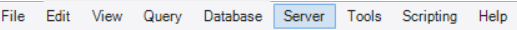\
Then, click on "Data Import/Restore":
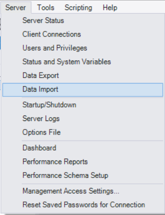\
This will open the following window:
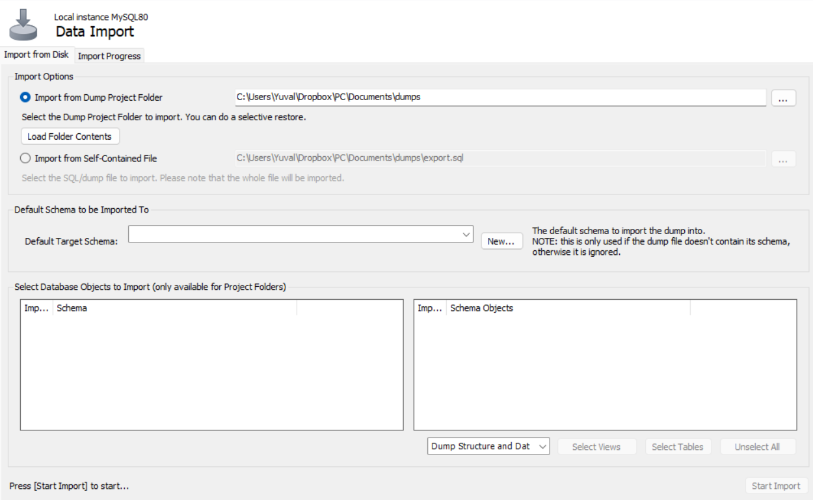\
Click on the "Import from Self-Contained File" button and select the file "music_social_network_final.sql" 
that you have downloaded.\
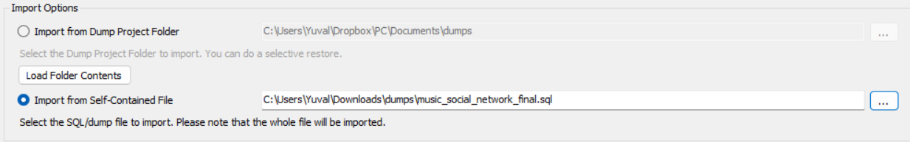\
Press the "new" button where it says "Default Target Schema" and name it "music_social_network".\
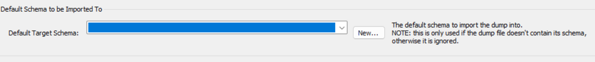\
Then, press the "Start Import" button.\
\
After completing all of the above steps, you should have a database in your local instance of MySql with our database schema
and data.

### Server
The server is written in Python, and uses the Flask framework.\
To install Python, go to the [download page](https://www.python.org/downloads/) and download the latest version of Python for your operating system.\
After the download is finished, run the installer and follow the instructions.\
It is recommended that you choose the default settings.\
\
Assuming you have the project files available, open a terminal and navigate to the "server" directory.\
Then, run the following command:
```
pip install -r requirements.txt
```
This will install all the required packages for the server to run.\
In addition, also install the following packages:
```bash
pip install flask-cors

# If on windows
pip install waitress

# If on linux
pip install gunicorn
pip install gevent
```

### Client
The client is written in TypeScript, and uses the React framework.\
To install, you will need to have Node.js installed.\
To install Node.js, go to the [download page](https://nodejs.org/en/download/) and download the latest version of Node.js for your operating system.\
After the download is finished, run the installer and follow the instructions.\
It is recommended that you choose the default settings.\
\
Assuming you have the project files available, open a terminal and navigate to the "client" directory.\
Then, run the following command:
```bash
npm install
```
This will install all the required packages for the client to run.

## Running the project
### Server
To run the server, first go to the server/config directory and find the .env file.\
In this file, you will see the following lines:
```python
DB_HOST=localhost
DB_USER=root
DB_PASSWORD=1234
DB_NAME=music_social_network
```
You will need to change the DB_USER and DB_PASSWORD to match your MySql instance.\
It may also be needed to set the values in the consts.py files, that contains the following:
```python
import os
from dotenv import load_dotenv

load_dotenv("config/.env")

DB_HOST = os.getenv("DB_HOST", "localhost")
DB_USER = os.getenv("DB_USER", "root")
DB_PASSWORD = os.getenv("DB_PASSWORD", "1234")
DB_NAME = os.getenv("DB_NAME", "music_social_network")
```
to have the same values as the .env file.\
\
After the configuration is done, open a terminal and navigate to the "server" directory.\
Then, run the following command:
```bash
# If on windows
waitress-serve --host 127.0.0.1  main:app     
# If on linux
python -m gunicorn -k gevent -w 8 -b 0.0.0.0:8080 main:app
```
This will run the server on port 8080, using a gunicorn or waitress server to serve the requests.\

### Client
To run the client, open a terminal and navigate to the "client" directory.\
Then, run the following command:
```bash
npm start
```
This will run the client on port 3000.\
\
After the server and client are running, you can access the client by going to the following address:
```
http://localhost:3000/
```
Assuming that the server is running locally on port 8080, everything should work.

## Using the client

### Login
When you first open the client, you will be presented with the login page:
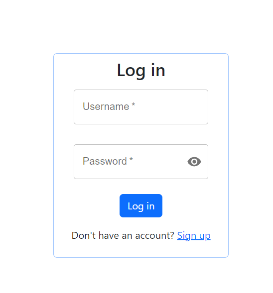\
In this page, you can use a username and password to log in as an existing user.\
If your username and password are correct, you will be redirected to the home page. Else, you will be shown an error message.\
\
If you do not have an account or wish to create a new account, you can click to the "Sign up" button
to go to the sign up page.\

#### Test users
The following users are already registered in the database:
1. username: a@g.com, password: abcde. This account was the main one used for testing. The other accounts are empty and have no data.
2. username: abcde, password: 1234
3. username: aaaa, password: 1234
4. username: bbbb, password: 1234

In addition to every other user that is registered in the database.\
These users are every single artist, meaning there are approximately 143000 others available to test with.\

### Sign up
When you click on the "Sign up" button, you will be redirected to the sign up page:\
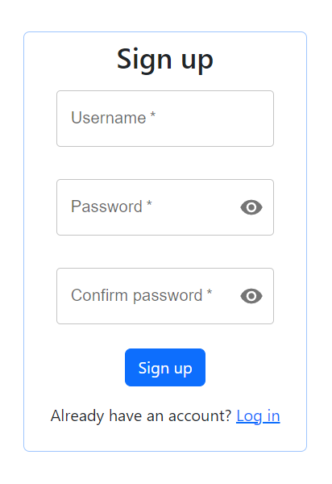\
In this page, you can create a new account by filling in the required fields.\
If you do not fill in all the fields, you will be shown an error message.\
Likewise, if you try to create an account with a username that already exists, you will be shown an error message.\
If you fill in all the fields correctly, you will be shown a message indicating your success.\
\
If you already have an account, you can use the "Log in" button to go to the login page.

### The main application
After logging in, you will be redirected to the home page, which will first look like this:\
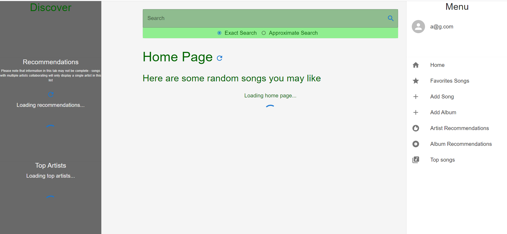\
This is normal - our home page takes a while to load, as it needs to fetch a lot of data and run some heavy queries on the database.\
\
After a few seconds, the page will look like this:\
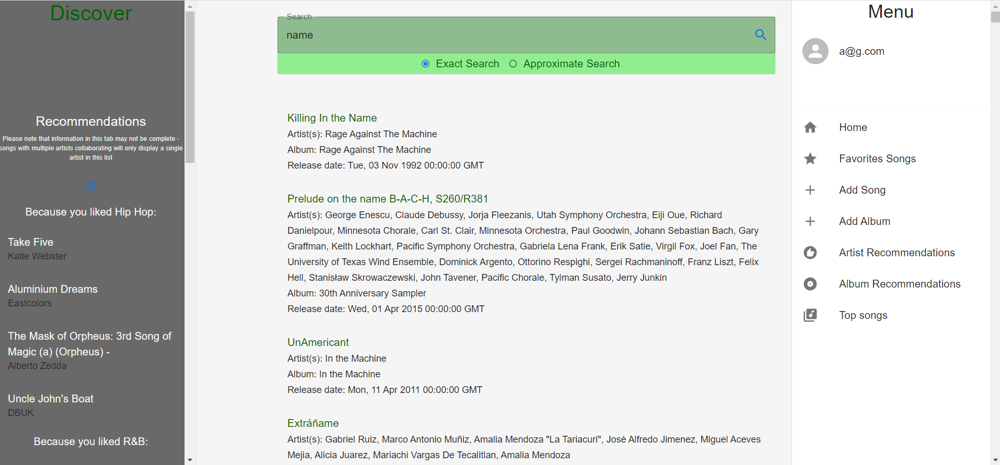
In this page, you can see 4 distinct sections:
1. The left hand side, containing the discover tab.
2. The top-middle, containing the search bar.
3. The centre, containing the main content.
4. The right hand side, containing the user and menu tab.
We will go over each of these in turn.

#### Discover tab
The discover tab is contains 2 types of recommendations:
1. Song recommendations - these are songs that are similar to songs that you have liked in the past.
2. Top artists - a list of the 10 top artists of all times.

The song recommendations part of it looks like this:\
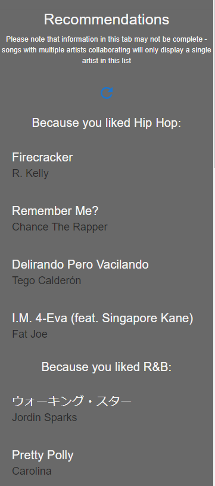\
Where you are given recommendations for about 10 songs, based on the genres that you have liked in the past.\
To refresh the recommendations, you can click on the "Refresh" button at the top of this part.\
Clicking on any song will redirect you to the song page of that song.\
If the system can not find any recommendations, it will show a message saying "No recommendations found". 
This happens when the system does not have data about the user.\
\
The top artists part of it looks like this:\
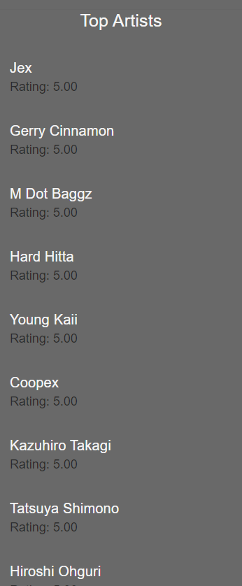\
Where you are given a list of the 10 top artists of all times.\
Clicking on any artist will redirect you to the artist page of that artist.

#### Search bar
The search bar is located at the top-middle of the page.\
It looks like this:\
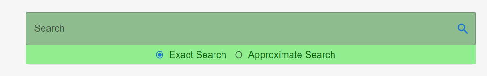\
This bar allows you to search for songs by their name.\
You can choose between 2 search modes:
1. Approximate search - this will search for songs that contain the search term in their name.
2. Exact search - this will search for songs that have the search term as their name.

The default search mode is exact search, and the search is not case sensitive.\
\
After you enter a search term and press enter or press the search button,
the middle part of the page will be replaced with the search results page.\
This page will look like this:\
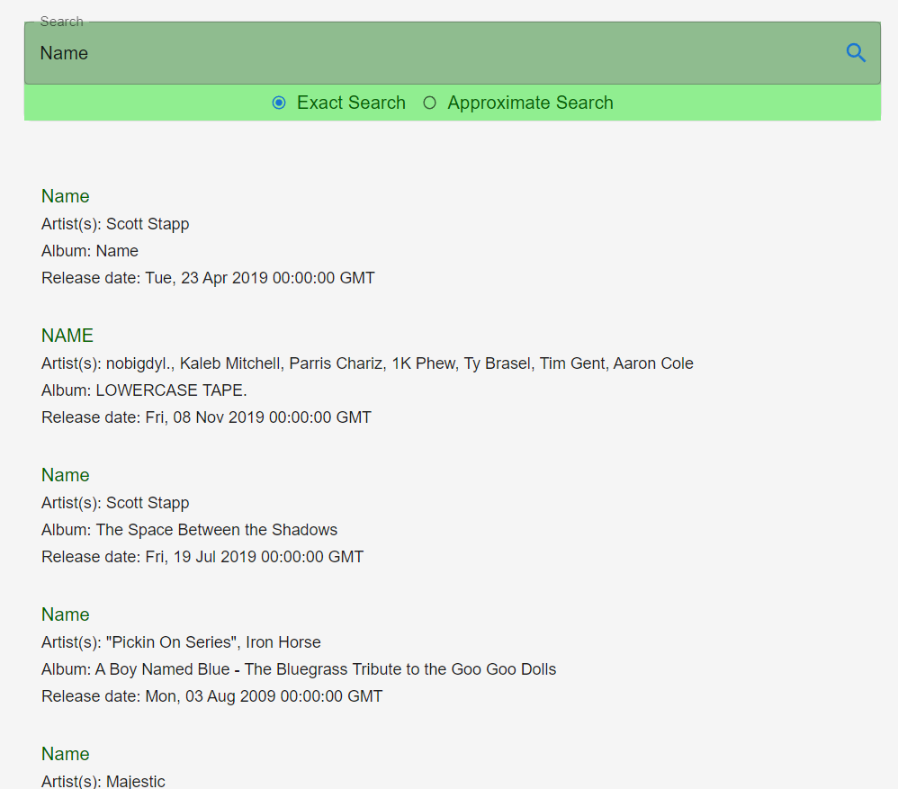\
In this page, you can see a list of songs that match your search term.\
In addition, the album, artists and release date of each song are also shown.\
Clicking on any song will redirect you to the song page of that song.\
\
The above results are for an exact search.\
If you choose to do an approximate search, the results will look like this:\
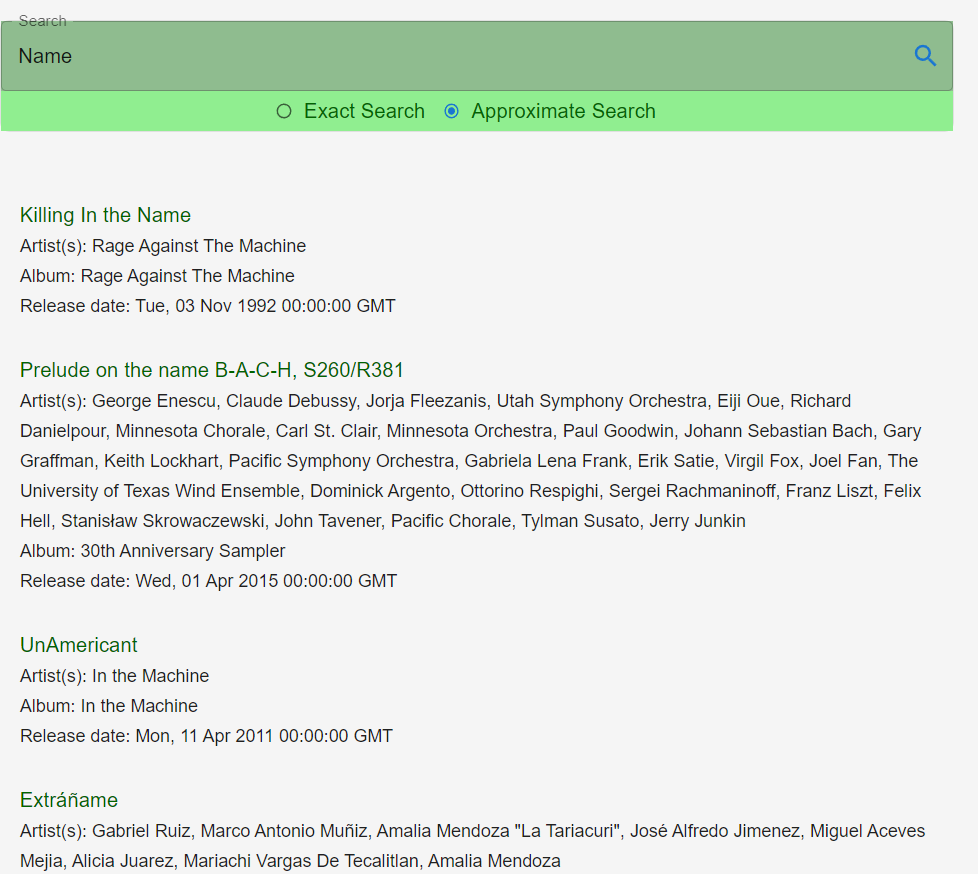\
In this page, you can see a list of songs that contain your search term in their name.\
Note that approximate searches may take significantly longer than exact searches.

#### User and menu tab
The user and menu tab is located at the right hand side of the page.\
It looks like this:\
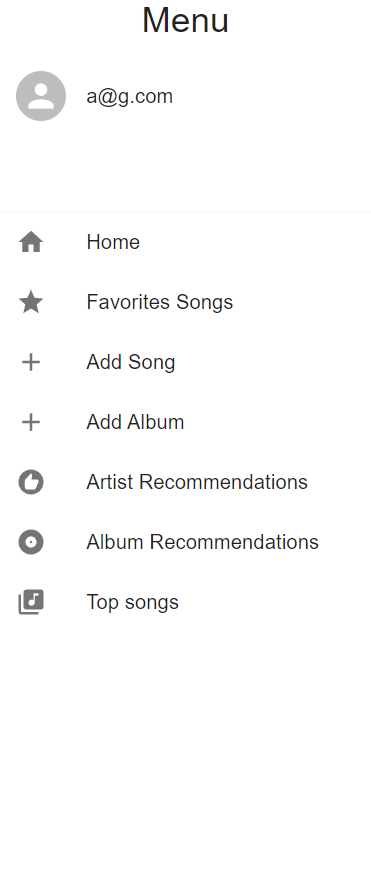\
In this tab, you can see your username at the top - clicking it will bring you to your own artist page.\
Below that, you can see a list of buttons.\
Each of these buttons allow you to navigate to a different page - these pages are covered later on in the manual.\

#### The main content section
The main content section is located at the centre of the page.\
This part of the page changes depending on the page that you are on.\
We will go over each of these pages in turn.

##### Home page
The home page is the first page that you see when you log in.\
It looks like this:\
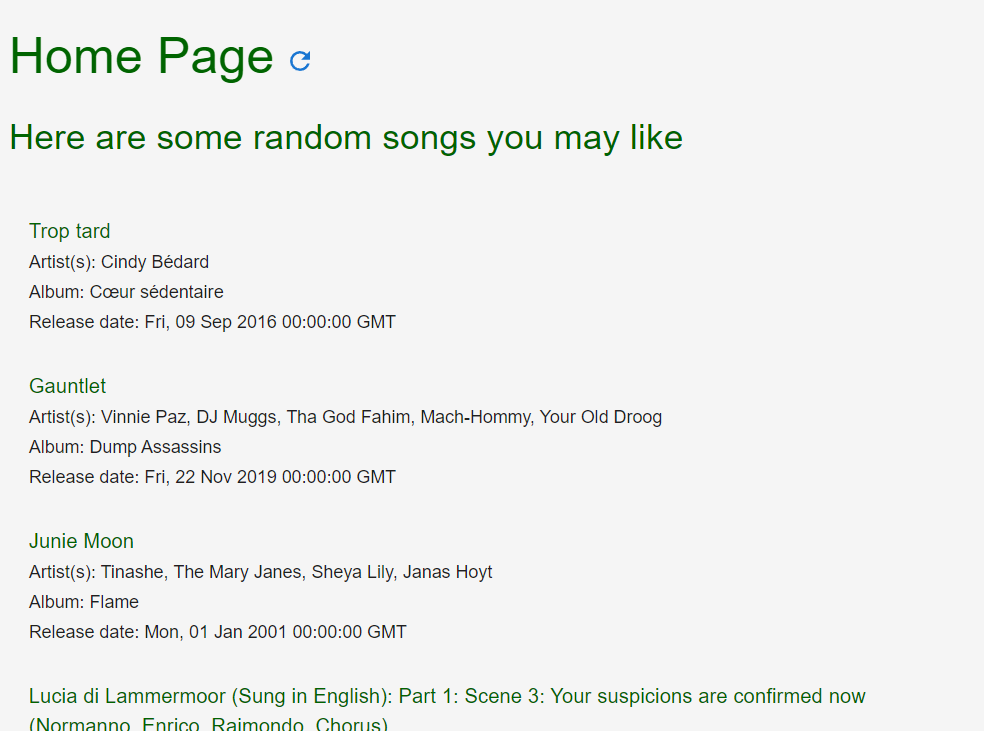\
In this page, you can see a list of random songs that were retrieved from the database.\
Clicking on any song will redirect you to the song page of that song.
\
Clicking on the "Home" button in the user and menu tab will also return you to this page.

##### Song page
The song page is the page that you are shown in the center of the application when you click on a song.\
It looks like this:\
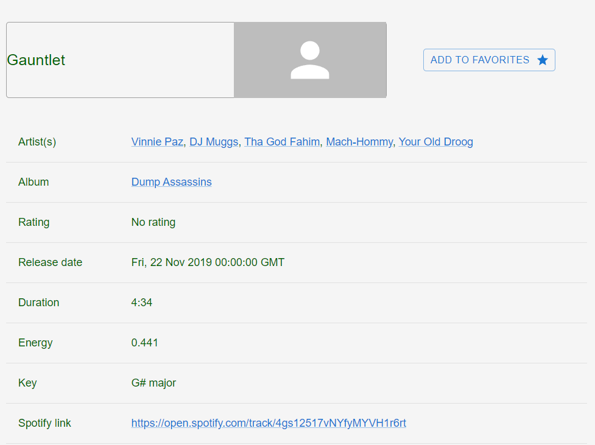\
In this page, you can see various types of information about the song.\
By clicking an artist, you will be redirected to the artist page of that artist.\
By clicking an album, you will be redirected to the album page of that album.\
By clicking "Add to favourites", you will add the song to your favourites.\
By clicking the spotify link below, you will have a new tab open with the song on spotify.\

By scrolling down, you will see the following:\
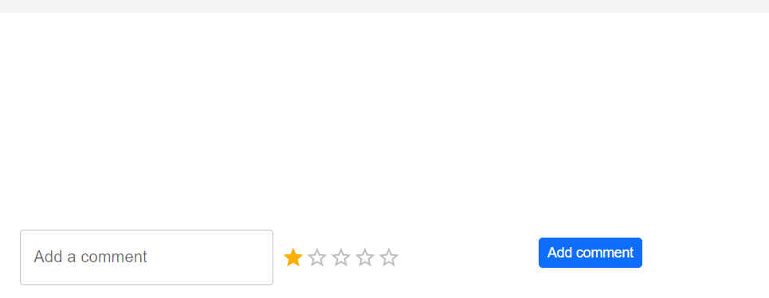\
In this part, you can see comments and ratings that other users have left for this song.\
You can also add your own comment and rating by filling in the fields at the bottom of this part.\
After you add your comment and rating, you will see your own comment, as well as be able to see that the song's rating
has been updated.\
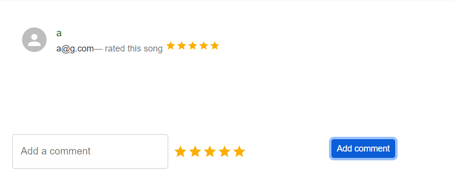\
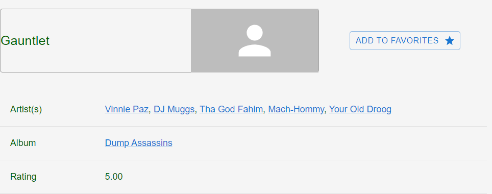

##### Artist page
The artist page is the page that you are shown in the center of the application when you click on an artist.\
It looks like this:\
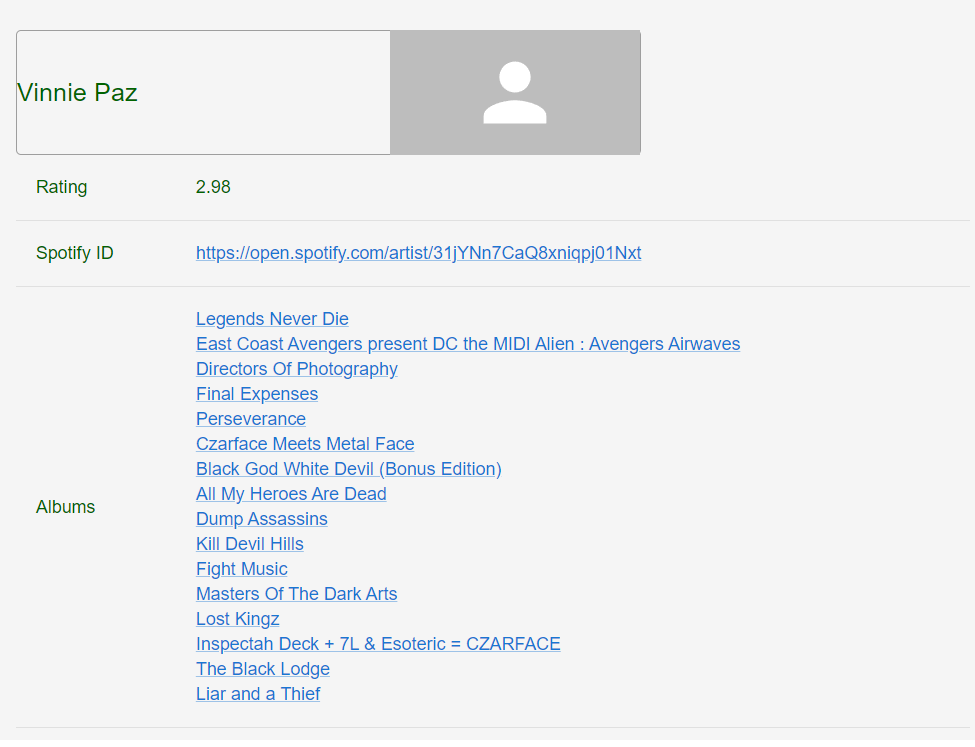\
In this page, you can see various types of information about the artist.\
By clicking the spotify link below, you will have a new tab open with the artist on spotify.\
By clicking an album, you will be redirected to the album page of that album.\

##### Album page
The album page is the page that you are shown in the center of the application when you click on an album.\
It looks like this:\
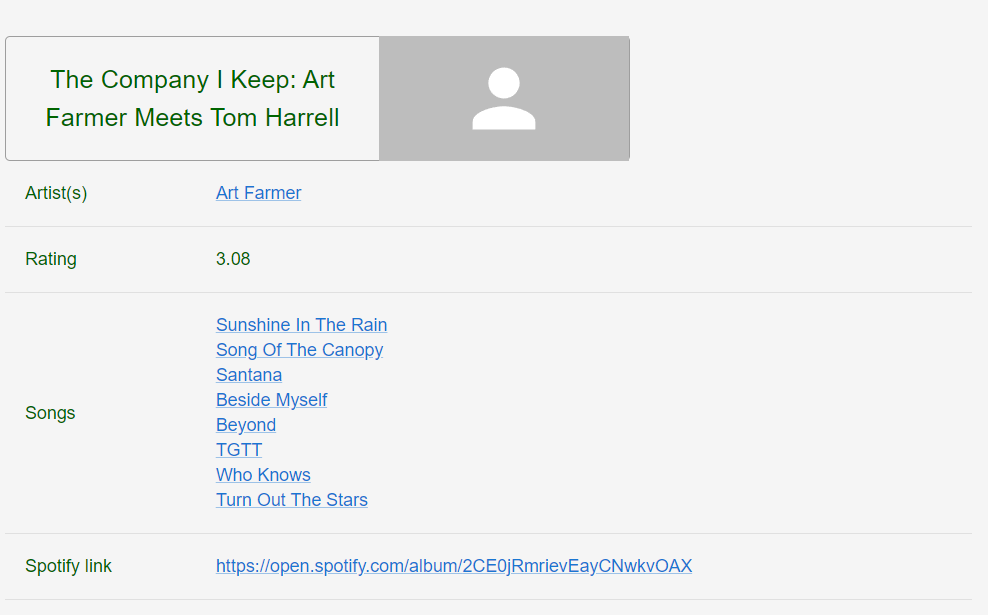\
In this page, you can see various types of information about the album.\
By clicking the spotify link below, you will have a new tab open with the album on spotify.\
By clicking a song, you will be redirected to the song page of that song.\
By clicking an artist, you will be redirected to the artist page of that artist.\

##### Favourite songs page
The favourite songs page is the page that you are shown in the center of the application when you click on the "Favourite songs" button in the user and menu tab.\
It looks like this:\
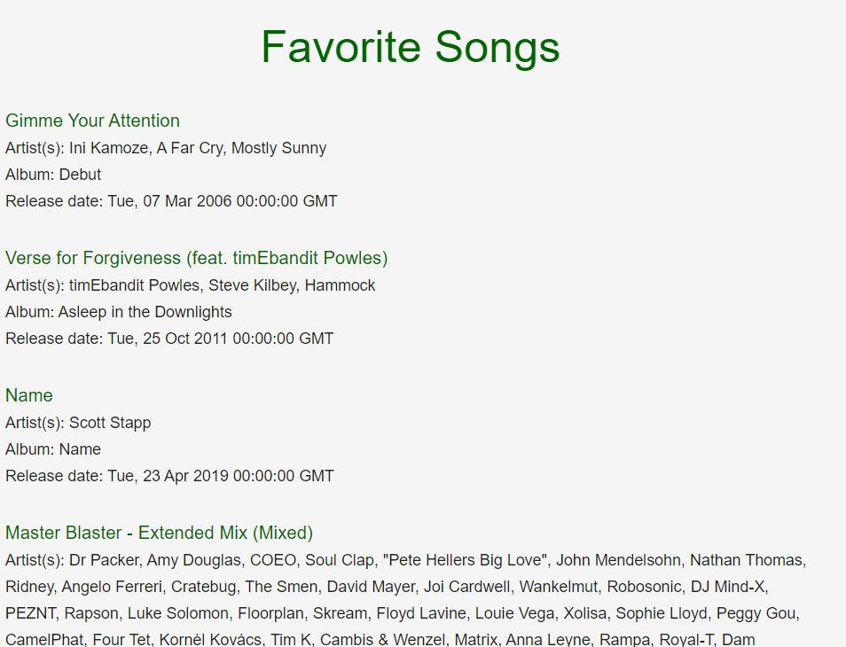\
In this page, you can see a list of songs that you have added to your favourites.\
Clicking on any song will redirect you to the song page of that song.\

##### Add song page
The add song page is the page that you are shown in the center of the application when you click on the "Add song" button in the user and menu tab.\
It looks like this:\
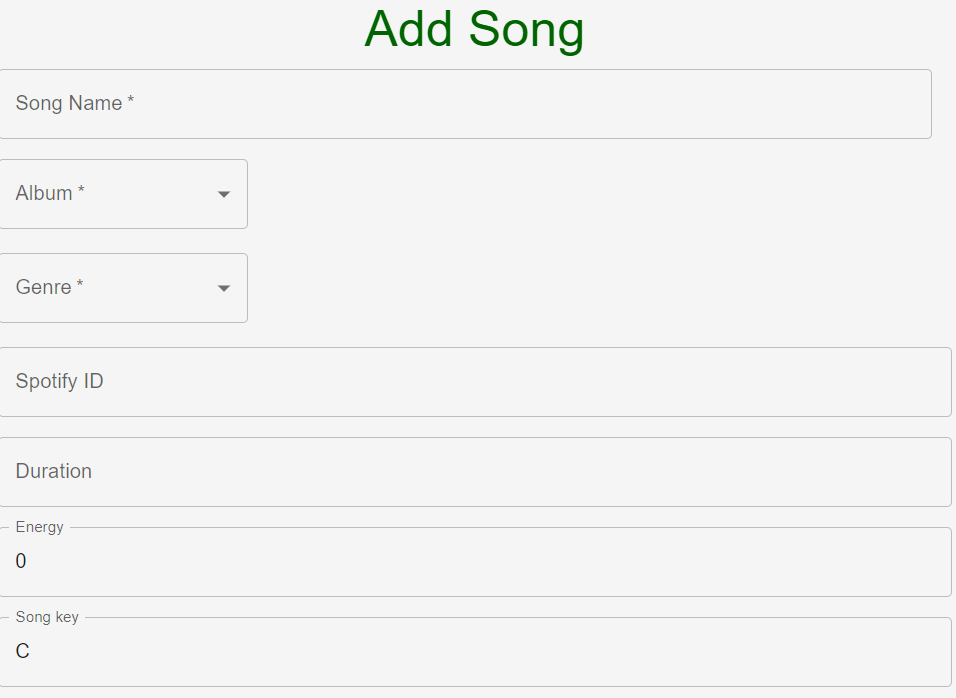\
By filling out all of the information needed, you can add a new song to the database.\
That song will always be considered one of your songs.\
The album list will load all albums that belong to the user. If the user has no albums, they should create one first in the "Add album" page.\
If all of the info the user input is valid, the song will be added and a success message will be shown.\
Else, an error message will be shown.\

##### Add album page
The add album page is the page that you are shown in the center of the application when you click on the "Add album" button in the user and menu tab.\
It looks like this:\
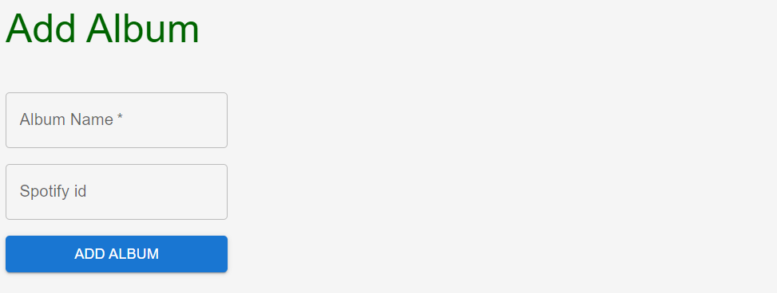\
By filling out all of the information needed, you can add a new album to the database.\
That album will always be considered one of your albums.\
If all of the info the user input is valid, the album will be added and a success message will be shown.\
Else, an error message will be shown.\

##### Artist recommendations page
The artist recommendations page is the page that you are shown in the center of the application when you click on the "Artist recommendations" button in the user and menu tab.\
It looks like this:\
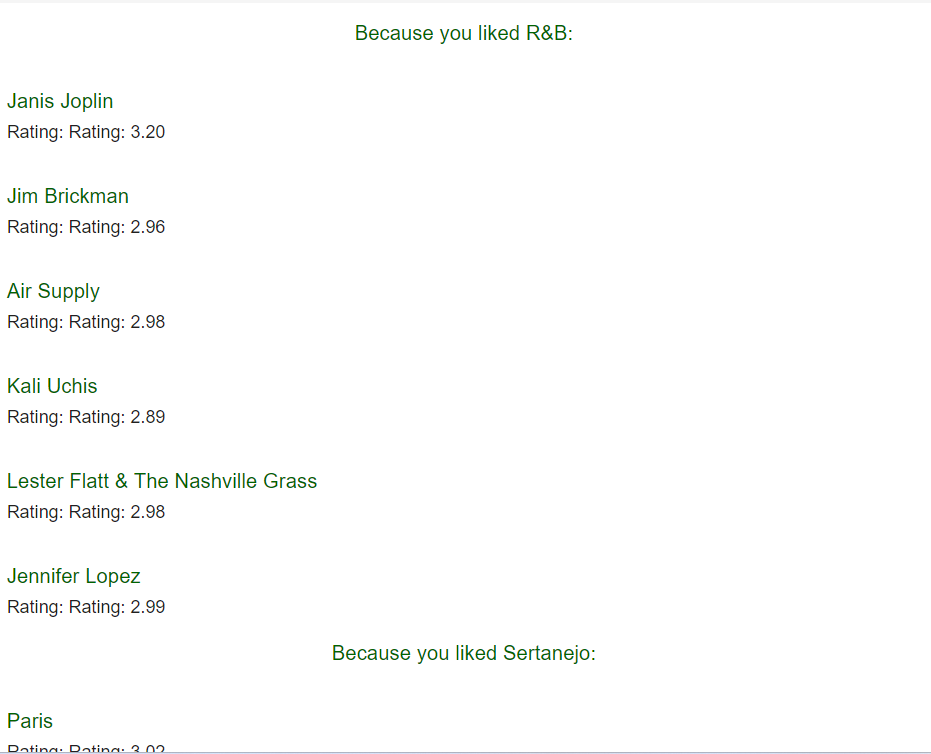\
In this page, you can see a list of artists that are of the same genres as songs that you liked.\
Clicking on any artist will redirect you to the artist page of that artist.\
\
Note that this page takes a while to load, as it has to run a recommendation algorithm on the database.\

##### Album recommendations page
The album recommendations page is the page that you are shown in the center of the application when you click on the "Album recommendations" button in the user and menu tab.\
It looks like this:\
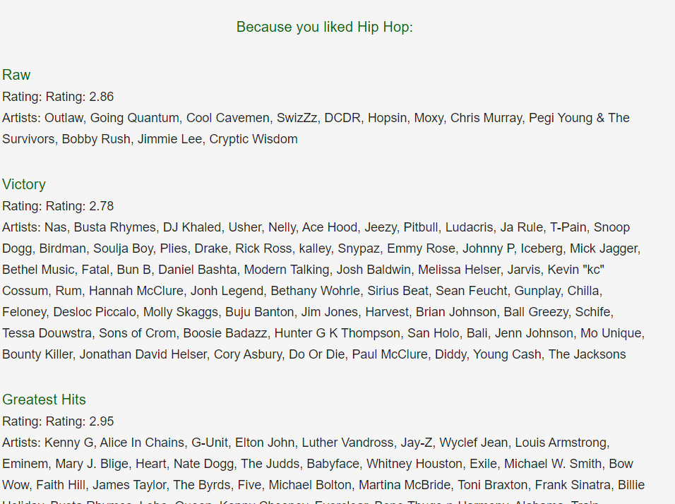\
In this page, you can see a list of albums that are in the same genres as songs that you liked.\
Clicking on any album will redirect you to the album page of that album.\
\
Note that this page takes a while to load, as it has to run a recommendation algorithm on the database.\

##### Top songs page
The top songs page is the page that you are shown in the center of the application when you click on the "Top songs" button in the user and menu tab.\
It initially looks like this:\
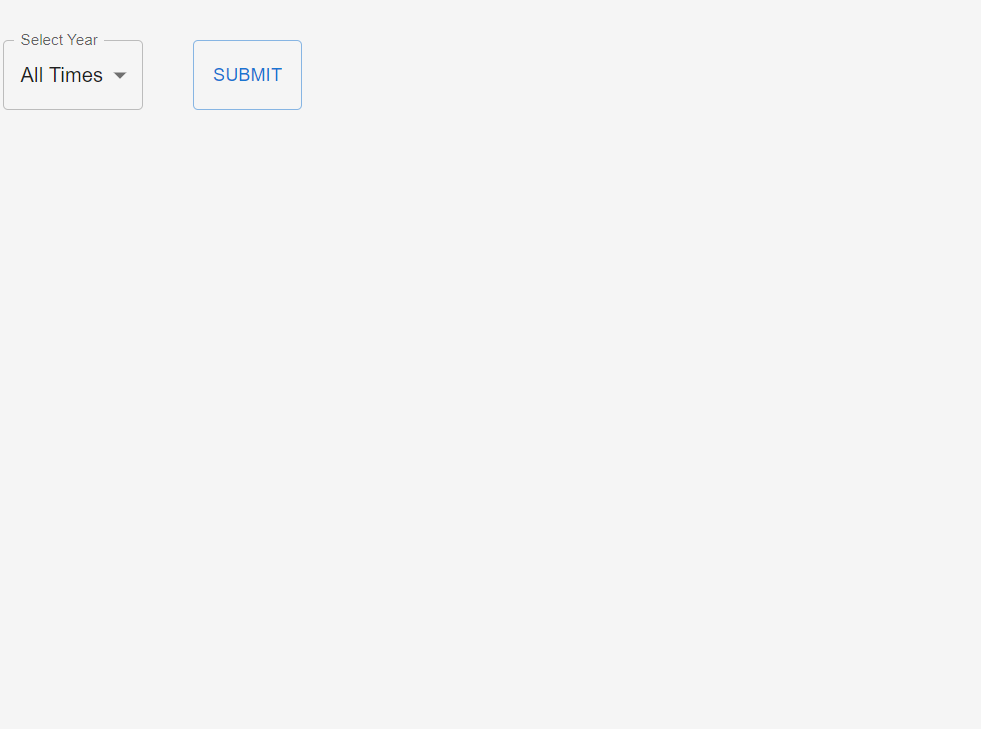\
After selecting a year (or staying with the default of "All times") and hitting submit, the page will look like this after loading:\
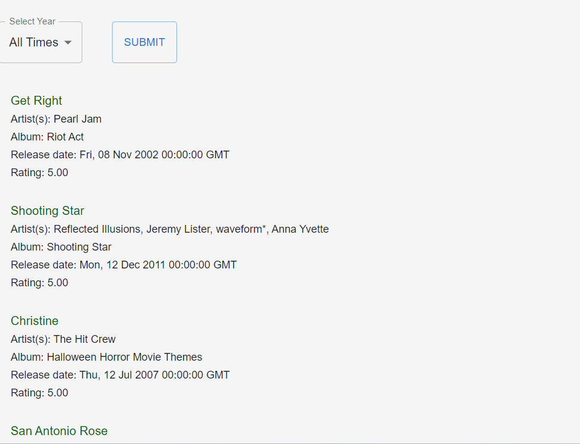\
In this page, you can see a list of songs that are the most popular in the selected year.\
Clicking on any song will redirect you to the song page of that song.\
\
If no songs were found in that year, a message will be shown instead.
